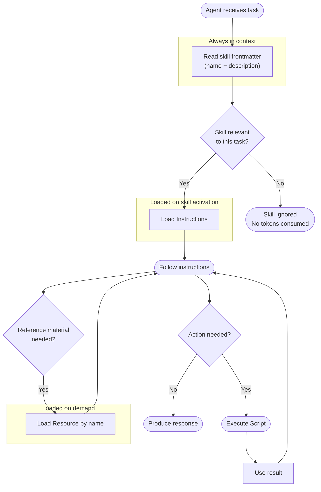

# AI agent skill

Defines an AI agent skill that teaches AI agents (like the [Harness AI agent](../agents/harness-ai-agent.md)) specialized knowledge and workflows — typically domain-specific processes and rules not generally known to AI models.


<br/>

## Properties
| Name                         | Required | Description                                                                 |
|------------------------------|----------|-----------------------------------------------------------------------------|
| Title                        | No | A descriptive title for the action. This value is not used by the system and serves only as a user-defined label to make the action easier to identify.  |
| [Skill name (frontmatter)](#skill-name-and-description-frontmatter)     | Yes | The name of the skill that will be presented to the AI model and used to determine whether the skill is loaded into context.  |
| [Skill description (frontmatter)](#skill-name-and-description-frontmatter) | Yes | A short description of the skill that will be presented to the AI model and used to determine whether the skill is loaded into context. |
| [Instructions](#instructions) | Yes | The instructions of the skill, which is the guidance the AI model follows once it has decided the skill is relevant. |
| [Scripts](#scripts)          | No  | The script provided by this skill. The scripts are only loaded into context if the AI model decides to use the skill based on the frontmatter `Skill name` and `Skill description`.  |
| [Resources](#resources)      | No  | Reference material bundled with the skill and loaded into context on demand. Resources are only read when the AI model determines they are needed for the current step. |
| Disabled                     | No | Disables the tool so it cannot be invoked by the AI agent.                 |
| Description                  | No | A developer description of the action. This value is not used by the system and serves only as a user-defined label to make the action easier to understand. |

<br/>

## Skill name and description (frontmatter)

The skill name and description are the only parts of a skill that the AI model always reads. Everything else — instructions, scripts, and resources — is only loaded into context if the model decides the skill is relevant to the current task. This makes the name and description the critical routing signal: they tell the model what the skill does and when to apply it.

**Skill name**

The name should identify what the skill covers, stated plainly. It will appear to the model exactly as written, so prefer clear noun phrases over internal codes or abbreviations. A good name answers "what is this skill for?" in a few words.

| Good | Avoid |
|------|-------|
| `invoice-processing` | `inv-proc-v2` |
| `customer-churn-analysis` | `Skill-4` |
| `budget-variance-reporting` | `BVR-helper` |

**Skill description**

The description should describe the situations and tasks the skill is meant to handle — specific enough that the model activates it at the right moment, but not so narrow that it misses valid uses. Write it as a single sentence or short paragraph that a colleague unfamiliar with the skill could read and immediately understand when to reach for it.

A good description answers:
- What does this skill help accomplish?
- What kind of input or context triggers it?
- What domain or system does it belong to?

**Example**

| Field | Value |
|-------|-------|
| Skill name | `invoice-processing` |
| Skill description | Guides the agent through creating, validating, and submitting invoices in the ERP system, including status transitions, required fields, and approval routing rules. |

<br/>

## Instructions

Instructions are the operational content of a skill — the guidance the AI model follows once it has decided the skill is relevant. Unlike the (frontmatter) name and description, instructions are only loaded into the model's context when the skill is activated, so they can be as detailed as the task requires without affecting unrelated runs.

Think of instructions as a briefing: they should tell the model exactly what to do, in what order, and under what conditions — written as if for a capable assistant who knows nothing about your specific business processes.

**What good instructions include**

- A clear statement of the skill's goal or responsibility
- Step-by-step guidance for the main workflow, including branching logic for different cases
- Explicit rules, constraints, or policies the model must respect (validation rules, approval thresholds, required fields)
- When and how to use any attached [scripts](#scripts) or [resources](#resources) — by name, and for what purpose
- What the model should return or do when the task is complete

**Tips**

- Write in imperative sentences: "Fetch the customer record", "Validate that the amount does not exceed the budget limit."
- Be explicit about edge cases and error conditions rather than assuming the model will infer them.
- If the skill has scripts or resources, reference them by name in the instructions so the model knows they exist and when to reach for them.
- Avoid vague phrases like "handle appropriately" — specify what appropriate means in your context.

**Example**

```txt
You are processing a new invoice submission. Follow these steps:

1. Extract the vendor name, invoice number, amount, and due date from the user's input.
2. Use the `validate-invoice` script to check that all required fields are present and that the amount does not exceed the vendor's approved credit limit.
3. If validation fails, list the specific errors and ask the user to correct them before proceeding.
4. If validation passes, use the `submit-invoice` script to create the invoice record in the ERP system.
5. Confirm the submission to the user and include the generated invoice ID.

Refer to the `invoice-status-codes` resource if you need to explain or validate a status transition.
```

<br/>

## Scripts
A skill script is an executable function the AI model can invoke while carrying out a skill's instructions. Each script has a name, a description, and defined input parameters — the model reads these to decide whether calling the script will help complete the current step.

Scripts are only loaded into context when the model chooses to activate the skill, so they do not consume tokens in unrelated runs. They are suited for actions the model needs to perform rather than just reference: fetching live data, transforming input, writing output, or triggering external systems. The model calls a script by name, passes the required arguments, and uses the returned result to continue reasoning.

To add scripts to the skill, attach one or more [Flow AI tool](../ai/flow-ai-tool.md) nodes to the `Scripts` port, and select the Flows you want to use as scripts. Note that you can only select flows with the [Flow AI tool trigger](../../triggers/ai/flow-ai-tool-trigger.md).
Include guidance in the skill's instructions about how and when the agent should use each script.


<br/>

## Resources
A skill resource is a named piece of reference content — such as a lookup table, a style guide, or a data schema — bundled with the skill but kept out of the model's active context until needed. When executing a skill's instructions, the model can request a resource by name if it determines the content is relevant to the current step.

This on-demand loading keeps the context window lean: resources that are never needed during a given run are never loaded. Resources are ideal for supplementary material that only some invocations require — reference content the model should be able to look up, but that would waste tokens if always present.

**Example**

| Field       | Value |
|-------------|-------|
| Name        | `invoice-status-codes` |
| Description | Lookup table mapping internal invoice status codes to their human-readable labels and allowed transitions. |
| Value       | See below |

```
| Code | Label      | Allowed next states     |
|------|------------|-------------------------|
| DR   | Draft      | SB                      |
| SB   | Submitted  | AP, RJ                  |
| AP   | Approved   | PD                      |
| RJ   | Rejected   | DR                      |
| PD   | Paid       | (none)                  |
```

The model only loads this resource when a skill instruction references it — for example, if the skill instructs the agent to "validate that the requested status transition is allowed, using the `invoice-status-codes` resource." Runs that never touch invoices never pay the token cost.

<br/>

## How a skill is used by an agent

The diagram below shows how an AI agent interacts with a skill at runtime — what is always read, what is loaded on demand, and when scripts are called. The progressive loading of instructions, resources, and scripts is what makes skills a key mechanism for reducing token usage — and cost — for AI agents.

