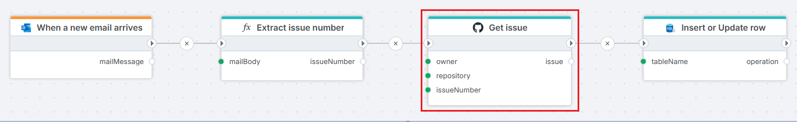

# Get issue

Gets a single issue from a GitHub repository by issue number.

**Example**   
This flow is [triggered](../../triggers/microsoft-365-outlook/when-new-email-arrives-trigger.md) by a mail notification. An issue number is extracted from the mail using a [function](../built-in/function.md). Having the issue number, the **Get Issue** action fetches the issue from a GitHub repository. Relevant issue information is then stored in a SQL Server table using the [Insert or Update row](../sql-server/insert-or-update-row.md) action.

 

## Properties

| Name             | Required |Description                                             |
|------------------|-----------|--------------------------------------------------------|
| Title  | No | The title of the action.   |
| Authentication | No | Select an authentication token. |
| Repository owner | Yes | Select or enter the repository owner. |
| Repository name | Yes | Select or enter the repository name. |
| Issue Number | Yes | The number of the issue to retrieve. |
| Text format | No | Text format for the result (Text / HTML / Raw). |
| Result variable name | No | Name of the variable containing the issue data. |
| Description | No | Additional notes or comments about the action or configuration. |

### Limitations

GitHub [limits](https://docs.github.com/en/rest/using-the-rest-api/rate-limits-for-the-rest-api?apiVersion=2022-11-28) the number of REST API requests that you can make within a specific amount of time.

You can make unauthenticated requests if you are only fetching public data. Unauthenticated requests are associated with the originating IP address, not with the user or application that made the request.
The primary rate limit for unauthenticated requests is 60 requests per hour.

For authenticated users the rate limit is 5,000 requests per hour. If the installation is on a GitHub Enterprise Cloud organization, the installation has a rate limit of 15,000 requests per hour.

### Authentication

Authentication is done with an authentication token. Click [here](https://docs.catalyst.zoho.com/en/tutorials/githubbot/java/generate-personal-access-token/) for more on creating a token.

 
