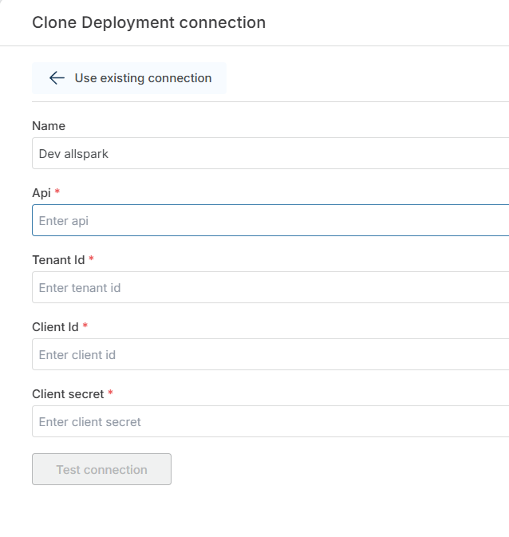

# AllSpark connection

To use any of the [Hypergene DevOps actions](./overview.md), you need to either select an existing **AllSpark connection** or create a new one. The connection holds the AllSpark API endpoint and the credentials used to authenticate, and is reused across actions in this category.

## Properties

| Name          | Required | Description |
|---------------|----------|-------------|
| Name          | No  | A custom name for the connection. This will be shown when selecting it in Flow actions. |
| Api           | Yes | The AllSpark API endpoint to connect to (for example, `dev.allspark.profitbase.biz`). |
| Tenant Id     | Yes | The tenant identifier used to authenticate against AllSpark. |
| Client Id     | Yes | The client identifier used to authenticate against AllSpark. |
| Client secret | Yes | The client secret used to authenticate against AllSpark. |

 

## Configuration steps

1. Provide a **Name** for the connection.
2. Enter the **Api** endpoint of the AllSpark environment you want to connect to.
3. Enter the **Tenant Id**, **Client Id**, and **Client secret** issued for your AllSpark integration.
4. Click **Test connection** to verify the setup.
5. If the test is successful, click **Ok** to save the connection.

