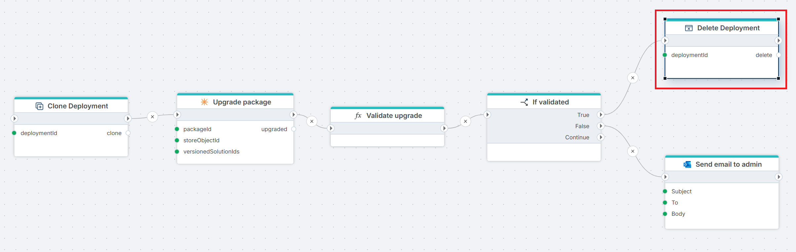

# Delete deployment

Deletes an existing Hypergene InVision deployment using the [AllSpark](https://allspark.profitbase.biz) API. The action takes the `deploymentId` of the instance to remove and returns a result indicating whether the operation succeeded.

**Example**   
This flow lets DevOps validate a package upgrade on a clone of a customer solution before touching production. It [clones](clone-invision-deployment.md) the customer's Hypergene InVision deployment from production, runs the [Upgrade package](../profitbase-invision/upgrade-package.md) action against the clone (which may take hours), and passes the result to a custom [Function](../built-in/function.md) action ("Validate upgrade") that checks the upgrade against business rules. The [If](../built-in/if.md) action then branches on the validation result — on success, the clone is **deleted** since it has served its purpose; on failure, an email is [sent](../microsoft-365-outlook/send-email.md) to the admin so they can investigate while the clone is preserved for inspection.

 

## Properties

| Name           | Required | Description |
|----------------|----------|-------------|
| Title          | No  | A descriptive label for the action. |
| Connection     | Yes | The [AllSpark connection](./connection.md) used to authenticate against the AllSpark API. |
| Deployment Id  | Yes | The identifier of the Hypergene InVision deployment to delete. Often supplied from an upstream [Clone deployment](./clone-invision-deployment.md) action via `Clone Deployment.deploymentId.DeploymentId`. |
| Result variable name | No | The name of the variable in which the result will be stored. Defaults to `delete`. |
| Disabled       | No  | Indicates whether the action is disabled (true/false). |
| Description    | No  | Additional notes or comments about the action or configuration. |

 

## Returns

A `DeleteDeploymentResult` object with the following property:

| Name | Type | Description |
|------|------|-------------|
| Success | bool | Indicates whether the delete operation succeeded. |

 

> [!NOTE]
> Deleting a deployment is a long-running operation. The Flow containing this action must be configured to run in long-running mode.

 

> [!WARNING]
> Deleting a deployment is irreversible. Make sure the `Deployment Id` refers to the correct instance before running the Flow.

 

