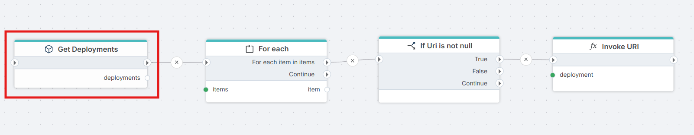

# Get deployments

Gets the Hypergene InVision deployments available through the [AllSpark](https://allspark.profitbase.biz) API. Use the result to look up a deployment before passing its `DeploymentId` to the [Clone deployment](./clone-invision-deployment.md) or [Delete deployment](./delete-invision-deployment.md) actions, or to iterate over all deployments with a [For each](../built-in/foreach.md) action.

**Example**   
This flow calls every Hypergene InVision deployment registered in AllSpark. It **gets** all deployments through the AllSpark connection, and a [For each](../built-in/foreach.md) action iterates over the returned list. For each deployment, an [If](../built-in/if.md) action checks whether `DeploymentUri` is set, since it is `null` for deployments without a registered URI. Only when it is set does a custom [Function](../built-in/function.md) action invoke the URI.

 

## Properties

| Name           | Required | Description |
|----------------|----------|-------------|
| Title          | No  | A descriptive label for the action. |
| Connection     | Yes | The [AllSpark connection](./connection.md) used to authenticate against the AllSpark API. |
| Result variable name | Yes | The name of the variable in which the result will be stored. Defaults to `deployments`. |
| Disabled       | No  | Indicates whether the action is disabled (true/false). |
| Description    | No  | Additional notes or comments about the action or configuration. |

 

## Returns

A `List<Deployment>`, where each `Deployment` has the following properties:

| Name | Type | Description |
|------|------|-------------|
| DeploymentId | string | The identifier of the Hypergene InVision deployment. |
| DeploymentName | string | The display name of the deployment. |
| DeploymentUri | string | The URI of the deployment, or `null` if none is registered. |
