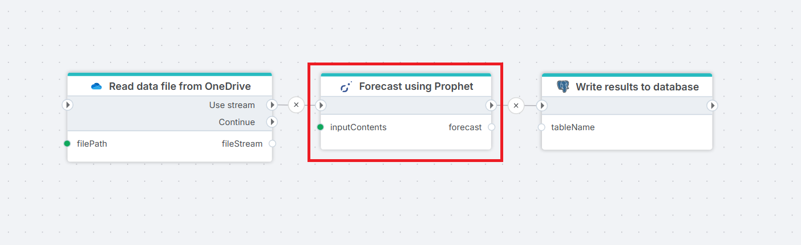

# Prophet Forecast

Forecasts time series data using the [Prophet](https://facebook.github.io/prophet/) algorithm developed by Meta. Prophet is designed for business time series with strong seasonal patterns and works well even with missing data or outliers.
Use this action when you need to predict future values for metrics such as sales, demand, costs, or any other measure that changes over time.

 

## Use-cases

- Forecasting monthly sales or demand when you have at least 2 years of history with clear seasonal patterns (e.g. retail with Q4 peaks)
- Generating bottom-up forecasts per product, region, or cost center from a single historical dataset using **Grouping columns**
- Projecting operating costs that follow weekly or monthly cycles, including the effect of national holidays (set **Country code**) or company-specific events like annual shutdowns (use **Custom holidays**)
- Producing forecasts with uncertainty bands (`yhat_lower`, `yhat_upper`) for scenario planning, rather than a single point estimate

 

**Example**   
This flow reads a historical time series from a [file in OneDrive](../onedrive/read-file-from-onedrive-as-stream.md), generates a forecast using **Prophet**, and [inserts the forecast results into a database](../postgresql/insert-data.md).

 

## Prerequisites

- A Flow action upstream that provides the historical time series as `byte[]`, `Stream`, `DataTable`, or `IDataReader`, an SQL query action, or a file read action)
- Historical data with a date column and a numeric value column, covering at least one full seasonal cycle (e.g. 24+ months for monthly seasonality)
- If using **Grouping columns**: each group must have enough observations to fit a model independently

 

## Properties

| Name | Required | Description |
|------|----------|-------------|
| Title | No | Display label for this action in the Flow editor. Does not affect execution. |
| Input contents | Yes | The data variable containing the historical time series to forecast. Accepts `byte[]`, `Stream`, `DataTable`, or `IDataReader`. |
| Input file format | Yes | The format of the input data — `csv` or `parquet`. Required only when the input is a `byte[]` or `Stream`. |
| Output file format | Yes | The format of the forecast result file — `csv` or `parquet`. |
| Configuration | No | Opens the configuration editor for Prophet algorithm parameters. See [Configuration](#configuration) below. |
| Result variable name | No | The name of the output variable that downstream actions can reference to consume the forecast result. Defaults to `forecast`. |
| Disabled | No | When checked, the action is skipped during Flow execution. Use this to temporarily exclude the forecast step without removing it from the Flow. |
| Description | No | Free-text notes visible only in the Flow editor. Use to document the purpose or context of this forecast step for other solution builders. |

 

## Input contents

> [!IMPORTANT]
> In case of CSV file - it needs to have: comma separator and a header row.

## Input data format

The input data must contain at least two columns:

| Column | Description |
|--------|-------------|
| `ds` | The date or timestamp column. Must be a recognizable date format. |
| `y` | The numeric value to forecast. |

If your data uses different column names, use the **Date column alias** and **Value column alias** settings in the [Configuration](#configuration) editor to map them.

 

## Configuration

The configuration editor exposes the following Prophet algorithm parameters.

 

### Periods

**Required.** The number of future periods to forecast. The unit depends on the **Frequency** setting — for example, a frequency of `Month Start` with `Periods = 12` produces a 12-month forecast.

 

### Frequency

**Required.** The time unit for each forecast period. Select the frequency that matches the granularity of your historical data.

| Value | Frequency |
|-------|-----------|
| `D` | Daily |
| `W-MON` | Weekly (week starts Monday) |
| `W-SUN` | Weekly (week starts Sunday) |
| `MS` | Month Start |
| `ME` | Month End |
| `QS` | Quarter Start |
| `QE` | Quarter End |
| `YS` | Year Start |
| `YE` | Year End |

 

### Growth

The growth model controls how Prophet models the overall trend.

| Value | Description |
|-------|-------------|
| `linear` | *(Default)* The trend grows or declines linearly over time. Suitable for most business metrics with no natural upper or lower bound. |
| `logistic` | The trend follows an S-curve, saturating at a defined capacity cap and optionally a floor. Use this when the metric is expected to level off — for example, user adoption in a market with a fixed population. |

When using logistic growth, you must provide a **cap** column in your input data. A **floor** column is optional but required if the series should not fall below a certain value.

 

### Logistic growth cap column

The name of the column in your input data that defines the maximum capacity (saturation point) for each row. Required when **Growth** is set to `logistic`. Defaults to `cap` if left blank.

 

### Logistic growth floor column

The name of the column in your input data that defines the minimum value (floor) for each row. Optional — only relevant when **Growth** is set to `logistic`. Defaults to `floor` if left blank.

 

### Date column alias

The name of the date column in your input data, if it is not named `ds`. For example, if your data has a column called `date` or `period`, enter that name here.

 

### Value column alias

The name of the value column in your input data, if it is not named `y`. For example, if your data has a column called `sales` or `amount`, enter that name here.

 

### Country code

A two-letter country code (e.g. `NO`, `US`, `GB`) that enables built-in public holiday effects for that country. When set, Prophet automatically accounts for the impact of national holidays on the forecast.

Leave blank if holidays are not relevant or if you prefer to define them manually using **Custom holidays**.

 

### Custom holidays

A list of custom holiday dates that Prophet should account for when fitting the model. Use this when your data is affected by company-specific events, local holidays, or any recurring or one-time dates not covered by the built-in country calendar.

Each holiday entry has the following fields:

| Field | Required | Description |
|-------|----------|-------------|
| Name | No | A descriptive label for the holiday (e.g. `"Black Friday"`, `"Annual Shutdown"`). |
| Day | Yes | The day of the month (1–31). |
| Month | Yes | The month (1–12). |
| Year | No | The year. Leave blank to make the holiday repeat every year. |
| Expand days before | No | Number of days before the holiday date to include in the holiday window. Useful for events with a lead-up effect. |
| Expand days after | No | Number of days after the holiday date to include in the holiday window. Useful for events with a trailing effect. |

 

### Grouping columns

Use **Grouping columns** when your input data contains time series for multiple entities — such as different products, regions, cost centers, or departments — and you want a separate forecast for each one.

For example, if your data has a `product` column with values like `"Widget A"`, `"Widget B"`, and `"Widget C"`, setting `product` as a grouping column will produce three independent forecasts: one for each product.

**How to specify grouping columns:**
Enter the column names as a comma-separated list, e.g. `region, product`.

> The column names must match exactly what appears in the input data (case-sensitive).

 

### Interval width

Controls the width of the uncertainty intervals around the forecast. Expressed as a probability between `0` and `1`. Defaults to `0.8` (80% credible interval).

A higher value produces wider bands (e.g. `0.95` gives a 95% interval), reflecting greater uncertainty. A lower value produces narrower bands. This setting affects the `yhat_lower` and `yhat_upper` columns in the output.

 

### Changepoint prior scale

Controls how flexible the trend is at changepoints — the points where the trend direction can shift. Defaults to `0.05`.

- **Higher values** (e.g. `0.5`) allow the trend to follow sharp turns in the historical data, at the risk of overfitting.
- **Lower values** (e.g. `0.001`) produce a smoother, more stable trend that ignores short-term fluctuations.

Increase this if the forecast trend seems too rigid; decrease it if it seems to chase noise.

 

### MCMC samples

The number of MCMC (Markov Chain Monte Carlo) samples to draw for full Bayesian inference. Defaults to `0`, which uses faster MAP estimation instead.

When set to a positive integer (e.g. `300`), Prophet runs full Bayesian sampling to produce more statistically rigorous uncertainty estimates — particularly for the seasonality components. This significantly increases computation time and is only recommended when accurate uncertainty quantification is a priority.

 

### Returns

A [byte](https://learn.microsoft.com/en-us/dotnet/api/system.byte?view=net-10.0) [array](https://learn.microsoft.com/en-us/dotnet/csharp/language-reference/builtin-types/arrays) representing the forecast results. The file contains all the standard Prophet forecast columns (`ds`, `yhat`, `yhat_lower`, `yhat_upper`) **plus** one column for each grouping column you specified. This lets you identify which forecast rows belong to which entity.

**Example output (grouped by `region` and `product`):**

| ds | region | product | yhat | yhat_lower | yhat_upper |
|----|--------|---------|------|------------|------------|
| 2025-01-01 | North | Widget A | 1240.5 | 1100.2 | 1380.8 |
| 2025-01-01 | North | Widget B | 870.3 | 790.1 | 950.4 |
| 2025-01-01 | South | Widget A | 530.0 | 480.5 | 579.5 |

 

> [!NOTE]
> Prophet trains a **separate model per group**. Groups with very few data points may produce less reliable forecasts. Ensure each group has sufficient historical data — Prophet generally works best with at least one full seasonal cycle of observations.