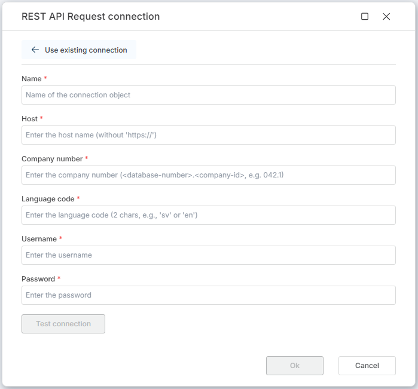

# Monitor ERP connection

To use Monitor ERP actions in **Hypergene Flow**, you need to select an **existing connection** or create a new one.

 

The connection authorizes Flow to interact with the Monitor ERP REST API on your behalf.

 

## Connection properties

A [Monitor ERP connection](https://api.monitor.se/) consists of the following fields:

| Name             | Description |
|------------------|-------------|
| Name  | A user-defined name for this connection. |
| [Host](https://api.monitor.se/articles/v1/url.html) | The **Host** part of the URL is the address of the Monitor ERP server that you are targeting. |
| [Language code](https://api.monitor.se/articles/v1/url.html) | The language code specifies the language that the API will scope the request to. It is case-insensitive and must be a valid ISO-639-1 (two letter) language code (default: sv). |
| [Company number](https://api.monitor.se/articles/v1/url.html) | A company number is the compound of a database number and company id. The company id is currently always 1. |
| Username | Authentication against the API is performed using the credentials of a normal Monitor ERP user. |
| Password | Corresponding password for the user. |

 

 

> [!NOTE]
> A [Dynamic Connection](./create-connection.md) can be used to override the default connection during flow execution.  
> This is useful when connecting to different organizations programmatically or pulling credentials from external sources at runtime.

## Related documentation

- [Create dynamic Monitor ERP connection](./create-connection.md)