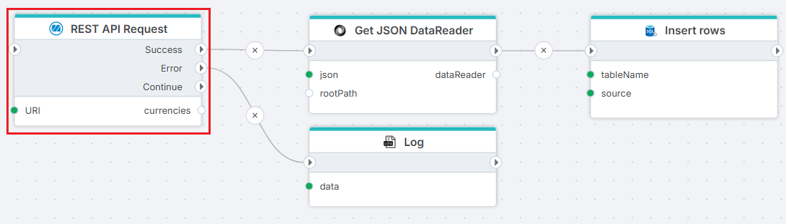

# Monitor ERP REST API Request

The **REST API Request** action allows you to interact with the [Monitor ERP REST API](https://api.monitor.se/) to read or write data. You can retrieve information such as vouchers, accounts, or customer invoices, or update records in Monitor ERP using HTTP methods (`GET`, `POST`, `PUT`, `DELETE`, etc.).

**Example** 

The example above shows how to read employees from Monitor ERP and insert the result into an SQL Server table. The result from the **REST API Request** is converted using the [JSON to DataReader](../json/get-json-datareader.md) action, and then inserted using the [SQL Server Insert](../sql-server/insert-data.md) action.

 

## Properties

| Name             | Required |Description                                             |
|------------------|-----------|--------------------------------------------------------|
| Title  | No | The title or name of the request. |
| Connection | Yes | The [Monitor ERP Connection](./connection.md) used to make an authenticated request to the Monitor ERP REST API. |
| Dynamic connection | No | Use this option if you need to use a connection created by the [Create Connection](./create-connection.md) action. |
| Configuration | Yes | Define configuration as described below. |
| Description | No | Additional notes or comments about the action or configuration. |

 

## Returns  

To maximize compatibility and performance, we recommend using the [HttpResponse&lt;T&gt;](../../api-reference/built-in-types/http-response.md) type. This provides:  
- The raw response body.  
- Additional details such as the HTTP status code and any errors.  

For further processing, store the raw JSON response in a database or file storage, and use data transformation tools to convert it into the required format.  

 

## Configuration  

### Defining a REST API Request  

To define a request to the Monitor ERP REST API, you can start from a template, or define it manually.
If you press the `New Request` button in the Configuration dialog, you can choose from a set of predefined request templates.  

The Monitor ERP REST API is large, so the template collection contains only a subset of the available APIs. If you cannot find a template for the request you want to make, you can refer to the [Monitor ERP API documentation](https://api.monitor.se/) and define the request manually.

1. **Method**: Choose the appropriate HTTP method for your request:  
   - `GET`: Retrieve data from Monitor ERP (e.g., get accounts or financial years).
   - `POST`: Create new records (e.g., add a new invoice or customer).  
   - `PUT`: Update existing records (e.g., modify accounting settings).  
   - `DELETE`: Remove records (e.g., delete a customer or invoice).  

2. **URI**: Specify the endpoint for your request. For example:  
   - `customers`: To manage customer records.  
   - `invoices`: To work with invoices.  

3. **Headers**: 
   - Authentication is automatically set up from the connection settings.

4. **Parameters**: Add query or body parameters as required by the endpoint. Use variables or fixed values based on your workflow to customize the request and ensure it retrieves or updates the desired data.  

5. **Response Type**: Use the default `HttpResponse<string>` to work with raw JSON data. For large datasets, this approach is recommended to reduce memory usage and improve performance.

 

## Error handling

If the response from the Monitor ERP request is of type [HttpResponse&lt;T&gt;](../../api-reference/built-in-types/http-response.md), the response object includes an `IsSuccess` property. If `IsSuccess` is false, the response object will contain an `ErrorContent` property, which relays error messages from the API call or internally thrown exceptions.

For other response types or severe errors, the action will raise an error that could terminate the Flow unless the On Error port is connected or the action is wrapped in a [Try-Catch](../built-in/try-catch.md) block.

The `On Error` handler is triggered for each page error, allowing you to manage errors individually and prevent the Flow from automatically raising an error that might terminate the running process.

 

## API Limits  

Monitor ERP enforces rate limits to maintain stable server performance. If you exceed these limits, the API will return a `429 Too Many Requests` error.
The action handles this by delaying calls and retrying requests. If the retry limit is reached, an error is returned.

 

By following these guidelines, you can integrate with the Monitor ERP API efficiently and avoid common pitfalls.

