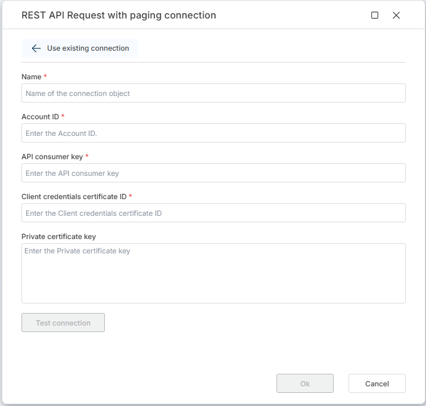

# NetSuite connection

To use NetSuite actions in **Hypergene Flow**, you need to select an **existing connection** or create a new one.
Configure it once, then select it from the Connection dropdown on any NetSuite action.

Use this static connection when the same credentials apply to every run of the Flow. If credentials must be supplied per execution — for example from a secrets store or because the Flow targets a different NetSuite integrations on each run — use the [Create NetSuite Connection](./create-connection.md) action instead.

 

The connection authorizes Flow to interact with the NetSuite REST API. It requires OAuth 2.0 (M2M) authentication credentials.

 

## Connection properties

A NetSuite connection consists of the following fields:

| Name             | Description |
|------------------|-------------|
| Connection Name  | A user-defined name for this connection. |
| Account ID       | The NetSuite account identifier for the target environment (your subscriptionr / realm). |
| API consumer key | The API consumer key used to authenticate requests (from the page where you create M2M integration in NetSuite). |
| Client credentials certificate ID | The ID of the certificate configured for client credentials authentication (from the NetSuite OAuth 2.0 Client Credential Setup). |
| Private certificate key | The private certificate key in PEM format used to sign authentication requests. |

 

 

## Related documentation

- [Create dynamic NetSuite connection](./create-connection.md)
- [Setting up OAuth2 M2M in NetSuite and creating certificat](https://docs.oracle.com/en/cloud/saas/netsuite/ns-online-help/section_157780218434.html).