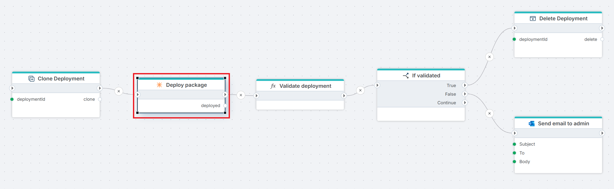

# Deploy package

Deploys a [Profitbase Store package](../../../invision/docs/package.md) to a folder in a Hypergene InVision instance, using a `.pbpck` package file referenced by its `Store Object Id`.

**Example**   
This flow lets DevOps validate a package deployment on a clone of a customer solution before touching production. It [clones](../hypergene-devops/clone-invision-deployment.md) the customer's Hypergene InVision deployment from production, runs the **Deploy package** action against the clone, and passes the result to a custom [Function](../built-in/function.md) action ("Validate deployment") that checks the deployment against business rules. The [If](../built-in/if.md) action then branches on the validation result — on success, the clone is [deleted](../hypergene-devops/delete-invision-deployment.md) since it has served its purpose; on failure, an email is [sent](../microsoft-365-outlook/send-email.md) to the admin so they can investigate while the clone is preserved for inspection.

> [!IMPORTANT]
> Deploying a package typically takes between a few minutes and one hour, depending on the package size. Any Flow that runs longer than five minutes must be configured to run in long-running mode.

 

## Properties

| Name | Required | Description |
|-----|------|-------------|
| Title | No | The name of the action as shown in the flow. |
| Connection | Yes | A valid [InVision Connection](invision-connection.md) pointing to the target InVision instance. |
| Parent ContentId | Yes | The Id of the parent folder in the InVision instance where the package will be deployed. |
| Store Object Id | Yes | The Id of the `.pbpck` package file in the Profitbase Store to deploy. |
| Result variable name | No | Name of the variable that stores the deployment result. Defaults to `deployed`. |
| Disabled | No | Indicates whether the action is disabled (true/false). |
| Description | No | Additional notes about the action or its configuration. |

 

## Returns

Returns the result of the package deployment.  
**If Result variable name** is specified, the result is stored in the given variable.