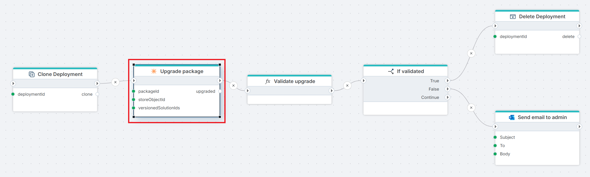

# Upgrade package

Upgrades an installed [Profitbase Store package](../../../invision/docs/package.md) in a Hypergene InVision instance to a newer version, using a `.pckup` upgrade file referenced by its `Store Object Id`. Packages installed in versioned solutions can be upgraded as well by providing the list of solution Id's.

> [!NOTE]
> When a package is upgraded, the currently installed version is deleted before the new version is installed. Any customizations made to the package will be lost. See [Upgrade Package](../../../invision/docs/package/upgrade-package.md) for the underlying upgrade behavior.

**Example**   
This flow lets DevOps validate a package upgrade on a clone of a customer solution before touching production. It [clones](../hypergene-devops/clone-invision-deployment.md) the customer's Hypergene InVision deployment from production, runs the **Upgrade package** action against the clone (which may take hours), and passes the result to a custom [Function](../built-in/function.md) action ("Validate upgrade") that checks the upgrade against business rules. The [If](../built-in/if.md) action then branches on the validation result — on success, the clone is [deleted](../hypergene-devops/delete-invision-deployment.md) since it has served its purpose; on failure, an email is [sent](../microsoft-365-outlook/send-email.md) to the admin so they can investigate while the clone is preserved for inspection.

> [!NOTE]
> This flow runs for a long time — package upgrades on real customer data can take hours. The Flow must be configured to run in long-running mode.

 

## Properties

| Name | Required | Description |
|-----|------|-------------|
| Title | No | The name of the action as shown in the flow. |
| Connection | Yes | A valid [InVision Connection](invision-connection.md) pointing to the target InVision instance. |
| Package Id | Yes | The Id of the package to upgrade. |
| Store Object Id | Yes | The Id of the `.pckup` upgrade file in the Profitbase Store to apply. |
| Versioned solution id's collection | No | A `List<string>` of solution Ids identifying versioned solutions in which the package should also be upgraded. Leave empty if the package is not installed in any versioned solutions. |
| Result variable name | No | Name of the variable that stores the upgrade result. Defaults to `upgraded`. |
| Disabled | No | Indicates whether the action is disabled (true/false). |
| Description | No | Additional notes about the action or its configuration. |

## Returns

Returns the result of the package upgrade.  
**If Result variable name** is specified, the result is stored in the given variable.
