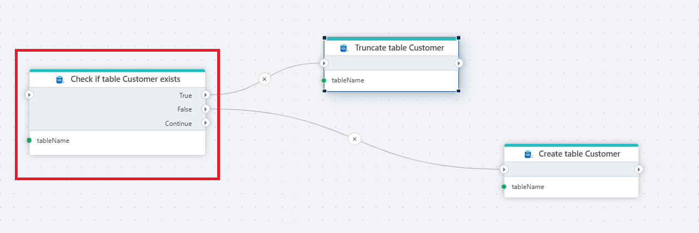

# Check if table exists

Checks whether a table exists in a SQL Server database and returns `true` or `false`. Use this to branch your Flow based on table state — for example, to create a table on the first run and truncate it on subsequent runs, preventing errors from missing or duplicate tables.

## When to use this

- Before loading data, to decide whether to create the target table or truncate existing rows.
- In deployment or migration Flows that set up database objects only if they don't already exist.
- To guard actions like [Truncate Table](./truncate-table.md) or [Delete Table](./delete-table.md) that fail when the table is missing.

## How it works

- **Input**: A table name and a SQL Server connection.
- **Output**: Routes to the **True** output port if the table exists, or the **False** output port if it does not. The **Continue** output port fires regardless of the result.

**Example**   
This flow prepares a `Customer` table before loading data. **Check if table Customer exists** queries the database and branches on the result. If the table exists (True), [Truncate Table](./truncate-table.md) clears the existing rows. If it does not (False), [Create Table](./create-table.md) creates it from scratch. Use this pattern at the start of data-loading Flows to guarantee the target table is present and empty without failing on the first run or duplicating data on subsequent runs.

 

## Properties

| Name            | Required | Description                                       |
|-----------------|----------|---------------------------------------------------|
| **Title**              | No | A descriptive title for the action.               |
| **Connection**      | Yes | The [SQL Server Connection](./connection.md) to the target database.         |
| **Enable dynamic connection** | No | When enabled, uses a connection created at runtime by [Create Connection](./create-connection.md). Use this when the target database varies between runs. |
| **Table name**      | Yes | The name of the table to check for. |
| **Command timeout (seconds)** | No | Maximum execution time in seconds. The action fails with a timeout error if exceeded. Default is 120 seconds. |
| **Disabled** | No | When checked, the action is skipped during Flow execution. |
| **Description**      | No | Additional notes or comments about the action or configuration. |

 

## Returns

[Boolean](https://learn.microsoft.com/en-us/dotnet/api/system.boolean). `true` if the table exists, `false` otherwise. The result is routed to the **True** or **False** output port of the action node.

 
## See also

- [Create Table](./create-table.md) — creates a new table in a SQL Server database.
- [Truncate Table](./truncate-table.md) — removes all rows from a table without dropping it.
- [Delete Table](./delete-table.md) — removes a table from the database entirely.
- [Connection](./connection.md) — how to set up a SQL Server connection.

 

[!INCLUDE]