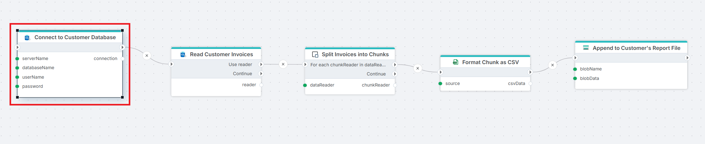

# Create SQL Server Connection

Builds a SQL Server connection at runtime from values you supply as inputs. Use this action when the target server, database, or credentials are not 
known at design time — for example, a multi-tenant Flow that runs against a different customer database on each execution, or an environment selector that switches between Dev, Test, and Prod.

The resulting connection is consumed by setting the **Dynamic connection** property of other SQL Server actions. **Dynamic connection** overrides the static **Connection** for the current execution.

If you store the credentials for the SQL Server outside Flow (for example in your own Azure SQL or PostgreSQL database), use this action to _dynamically_ create a connection. The connection returned from the action must then be used as the input to the `Dynamic connection` property of other SQL Server actions.

**Example**   
This flow exports invoices from a customer's database to a CSV file in blob storage — a multi-tenant pattern where the source database is different for each Flow execution. **Create SQL Server Connection** builds the connection from the inputs and exposes the result on its `connection` output. [Get DataReader](./get-datareader.md) reads rows from the source table. [Split Invoices into Chunks](../built-in/datareader-chunker.md) divides the stream into smaller batches, and [Format Chunk as CSV](../csv/create-csv-file-as-byte-array.md) serializes each batch. [Append to Customer's Report File](../azure-blob-storage/append-to-blob.md) appends each chunk to a blob. Use this pattern whenever the target database is resolved at runtime — multi-tenant exports or environment selectors that run the same Flow against different databases.

 

## Connection properties

 

### Connection type

A connection type (also called authentication type) must be selected before entering the other properties.

- **SQL Server Authentication** – Use a SQL Server username and password. *(Default)*
- **Microsoft Entra Password** – Authenticate with a Microsoft Entra identity using a username and password.
- **Microsoft Entra Service Principal** – Authenticate with a Microsoft Entra service principal using its client ID and secret.
- **User Connection String** – Supply a full connection string.

 

#### SQL Server and Microsoft Entra Password authentication

| Name | Required | Description |
|---|---|---|
| **Server name** | Yes | The name of the SQL Server. This can be the server name, IP address, or a named instance. |
| **Database name** | Yes | Defines the specific database on the SQL Server to which the connection is made. |
| **Username** | Yes | The username (or Entra ID/email) used to authenticate the connection. |
| **Password** | Yes | The password associated with the user to authenticate the connection. |
| **Enable Multiple Active Result Sets** | No | This setting allows a single database connection to run multiple queries at the same time, without waiting for one to finish before starting another. [Read more](https://learn.microsoft.com/en-us/sql/connect/ado-net/sql/enable-multiple-active-result-sets?view=sql-server-ver16) |

#### Microsoft Entra Service Principal authentication

| Name | Required | Description |
|---|---|---|
| **Server name** | Yes | The name of the SQL Server. This can be the server name, IP address, or a named instance. |
| **Database name** | Yes | Defines the specific database on the SQL Server to which the connection is made. |
| **Client ID** | Yes | The Client ID of the Microsoft Entra service principal (also known as an app registration). |
| **Client secret** | Yes | The client secret (application secret) associated with the service principal in Microsoft Entra. |
| **Enable Multiple Active Result Sets** | No | This setting allows a single database connection to run multiple queries at the same time, without waiting for one to finish before starting another. [Read more](https://learn.microsoft.com/en-us/sql/connect/ado-net/sql/enable-multiple-active-result-sets?view=sql-server-ver16) |

#### User Connection String

| Name | Required | Description |
|---|---|---|
| **Connection String** | Yes | A full connection string that can be used to establish a SQL Server connection. |

## Returns

A SQL Server connection **variable** named according to the **Connection variable name** property (default: `connection`). 