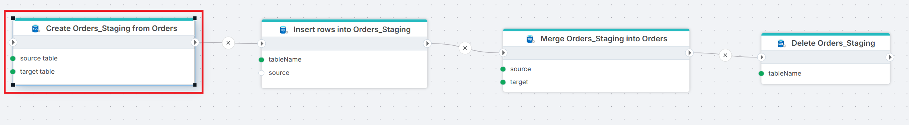

# Create table from source

Copies the schema of an existing table or view to a new table in the same SQL Server database. Data is not copied — only the table structure (columns, types, and optionally keys and indexes).

Use this to create staging, backup, or snapshot tables that match a source schema without manual column definitions.

## When to use this

- To create a staging table that mirrors a production table's schema before loading data into it.
- To set up empty archive or snapshot tables with the same structure as the source, so data can be inserted later.

## How it works

- **Input**: A source table (or view) name and a target table name, both on the same connection.
- **Processing**: Reads the schema of the source table and creates the target table with matching columns and types. Optionally copies the primary key, foreign keys, and indexes. If **Replace existing table** is checked and the target already exists, the existing table is dropped and recreated. If unchecked and the target exists, the action raises an error.
- **Output**: No return value. The target table is created.

> [!WARNING]
> When **Replace existing table** is checked, the existing target table and all its data are dropped before the new table is created. This is irreversible.

**Example**   
This flow runs a full staging cycle. **Create Orders_Staging from Orders** clones the schema from `Orders` to `Orders_Staging` with **Replace existing table** checked, so the staging table is recreated on every run. [Insert Rows](./insert-data.md) loads data into the staging table. [Merge Tables](./merge-tables.md) merges the staged rows into production, and [Delete Table](./delete-table.md) drops the staging table afterward. Use this pattern when the staging table must match the source schema exactly and be rebuilt on each execution.

 

## Properties

| Name         | Required | Description                                       |
|--------------|----------|---------------------------------------------------|
| **Title**              | No | A descriptive title for the action.               |
| **Connection**      | Yes | The [SQL Server Connection](./connection.md) to the database containing the source table.         |
| **Enable dynamic connection** | No | When enabled, uses a connection created at runtime by [Create Connection](./create-connection.md). Use this when the target database varies between runs. |
| **Source table** | Yes | The name of the existing table or view whose schema to copy. You can select from the table picker or enter a name manually. |
| **Target table** | Yes | The name of the new table to create. |
| **Replace existing table** | No | When checked, drops the target table if it already exists and recreates it. When unchecked, the action raises an error if the target table exists. Checked by default. |
| **Copy primary key** | No | When checked, copies the primary key constraint from the source table to the target. |
| **Copy foreign key(s)** | No | When checked, copies foreign key constraints from the source table to the target. |
| **Copy index(es)** | No | When checked, copies indexes from the source table to the target. |
| **Command timeout (seconds)** | No | Maximum execution time in seconds. The action fails with a timeout error if exceeded. Default is 120 seconds. |
| **Disabled** | No | When checked, the action is skipped during Flow execution. |
| **Description**   | No | Additional notes or comments about the action or configuration. |

 

## Returns

No return value. The action creates the target table.

## See also

- [Create Table](./create-table.md) — creates a table with a manually defined column schema.
- [Check if Table Exists](./check-if-table-exists.md) — checks whether a table exists before operating on it.
- [Truncate Table](./truncate-table.md) — removes all rows from a table without dropping it.
- [Delete Table](./delete-table.md) — removes a table from the database.
- [Connection](./connection.md) — how to set up a SQL Server connection.

 

[!INCLUDE]