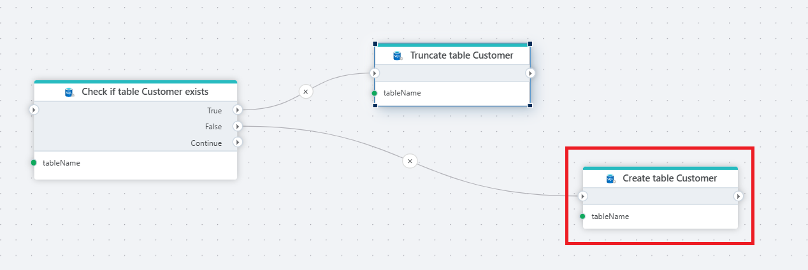
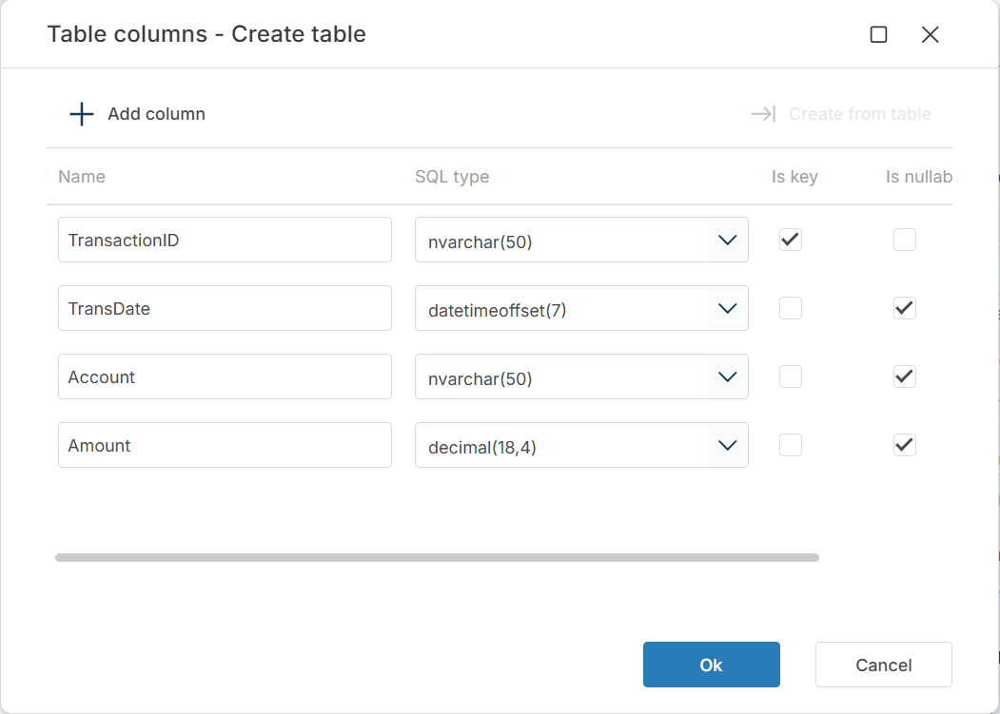

# Create table

Creates a table in a SQL Server database. If the table already exists, the action does nothing and no error is raised.

Use this to provision tables dynamically as part of data-loading or deployment Flows — for example, creating a staging table on the first run and skipping creation on subsequent runs when paired with [Check if Table Exists](./check-if-table-exists.md).

## When to use this

- To set up staging or target tables before loading data, so the Flow works on a clean environment without manual database preparation.
- In deployment or migration Flows that create database objects only when they don't already exist.
- To create tenant-specific or run-specific tables at runtime using a dynamic connection and parameterized table names.

## How it works

- **Input**: A table name, a SQL Server connection, and a column definition specifying each column's name, SQL type, key status, and nullability.
- **Output**: No return value. Downstream actions can reference the created table by name.

**Example**   
This flow prepares a `Customer` table before loading data. [Check if Table Exists](./check-if-table-exists.md) queries the database and branches on the result. If the table exists (True), [Truncate Table](./truncate-table.md) clears the existing rows so data is not duplicated. If it does not (False), **Create Table** creates it with the configured column schema. Use this pattern at the start of data-loading Flows to guarantee the target table is present and empty — it prevents errors on the first run (table missing) and data duplication on subsequent runs.

 

## Properties

| Name            | Required | Description                                       |
|-----------------|----------|---------------------------------------------------|
| **Title**              | No | A descriptive title for the action.               |
| **Connection**      | Yes | The [SQL Server Connection](./connection.md) to the target database.         |
| **Enable dynamic connection** | No | When enabled, uses a connection created at runtime by [Create Connection](./create-connection.md). Use this when the target database varies between runs. |
| **Table name**   | Yes | The name of the table to create.  |
| **Column definitions** | Yes | The table schema — a list of columns with SQL types, key constraints, and nullability. See [Column definitions](#column-definitions) below. |
| **Command timeout (seconds)** | No | Maximum execution time in seconds. The action fails with a timeout error if exceeded. Default is 120 seconds. |
| **Disabled** | No | When checked, the action is skipped during Flow execution. |
| **Description**   | No | Additional notes or comments about the action or configuration. |

 

### Column definitions

Click the edit icon next to **Column definitions** to open the column editor. You can define columns manually with **+ Add column**, or click **Create from table** to import the schema from an existing table.

Each column has four fields:

| Field | Description |
|-------|-------------|
| **Name** | The column name as it will appear in the database table. |
| **SQL type** | The SQL Server data type, including precision where applicable (e.g. `nvarchar(50)`, `decimal(18,4)`, `datetimeoffset(7)`). |
| **Is key** | When checked, the column is part of the primary key. |
| **Is nullable** | When checked, the column accepts `NULL` values. |

 

## Returns

No return value. The action creates the table. If the table already exists, the action completes successfully without changes.

## See also

- [Check if Table Exists](./check-if-table-exists.md) — checks whether a table exists before creating or truncating it.
- [Create Table from Source](./create-table-from-source.md) — creates a table with a schema derived from an existing source.
- [Truncate Table](./truncate-table.md) — removes all rows from a table without dropping it.
- [Delete Table](./delete-table.md) — removes a table from the database.
- [Connection](./connection.md) — how to set up a SQL Server connection.

 

[!INCLUDE]