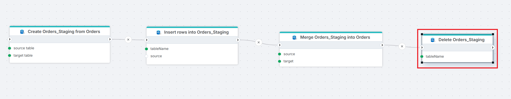

# Delete table

Drops a table from a SQL Server database. If the table does not exist, the action completes without error.

Use this to clean up temporary or staging tables after data has been processed, or to remove obsolete tables as part of deployment and migration Flows.

> [!WARNING]  
> This action permanently drops the table and all its data. This is irreversible.

## When to use this

- To remove staging tables after their data has been merged into production tables.
- To clean up temporary tables created during Flow execution.
- In deployment Flows that tear down and rebuild database objects.

## How it works

- **Input**: A table name and a SQL Server connection.
- **Processing**: Drops the specified table from the database. If the table does not exist, the action completes silently — no error is raised.
- **Output**: No return value.

 

**Example**   
This flow runs a full staging cycle. [Create Table from Source](./create-table-from-source.md) clones the `Orders` schema into `Orders_Staging`. [Insert Rows](./insert-data.md) loads data into the staging table. [Merge Tables](./merge-tables.md) merges the staged rows into the production `Orders` table. Finally, **Delete Orders_Staging** drops the staging table, which is no longer needed. Use Delete table at the end of ETL Flows to clean up temporary tables between runs.

 

## Properties

| Name            | Required | Description                                       |
|-----------------|----------|---------------------------------------------------|
| **Title**              | No | A descriptive title for the action.               |
| **Connection**      | Yes | The [SQL Server Connection](./connection.md) to the database containing the table.         |
| **Enable dynamic connection** | No | When enabled, uses a connection created at runtime by [Create Connection](./create-connection.md). Use this when the target database varies between runs. |
| **Table name**   | Yes | The name of the table to drop. |
| **Command timeout (seconds)** | No | Maximum execution time in seconds. The action fails with a timeout error if exceeded. Default is 120 seconds. |
| **Disabled** | No | When checked, the action is skipped during Flow execution. |
| **Description**   | No | Additional notes or comments about the action or configuration. |

 

## Returns

No return value. The action drops the table.

## See also

- [Create Table](./create-table.md) — creates a table with a manually defined column schema.
- [Create Table from Source](./create-table-from-source.md) — creates a table by cloning the schema of an existing table.
- [Check if Table Exists](./check-if-table-exists.md) — checks whether a table exists before operating on it.
- [Truncate Table](./truncate-table.md) — removes all rows from a table without dropping it.
- [Connection](./connection.md) — how to set up a SQL Server connection.

 

[!INCLUDE]