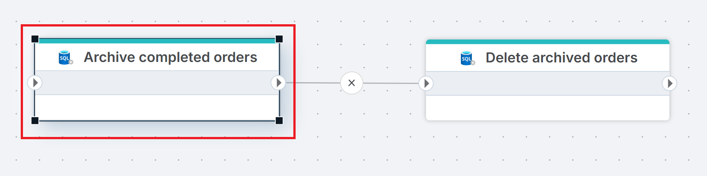
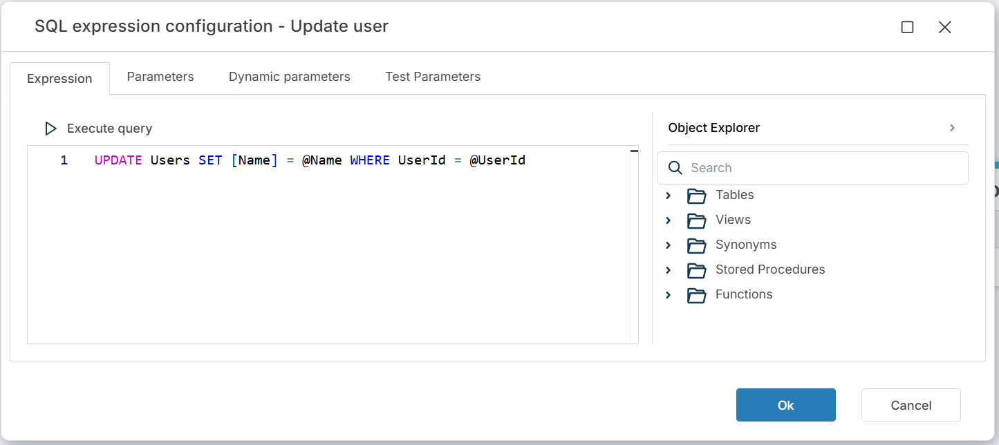
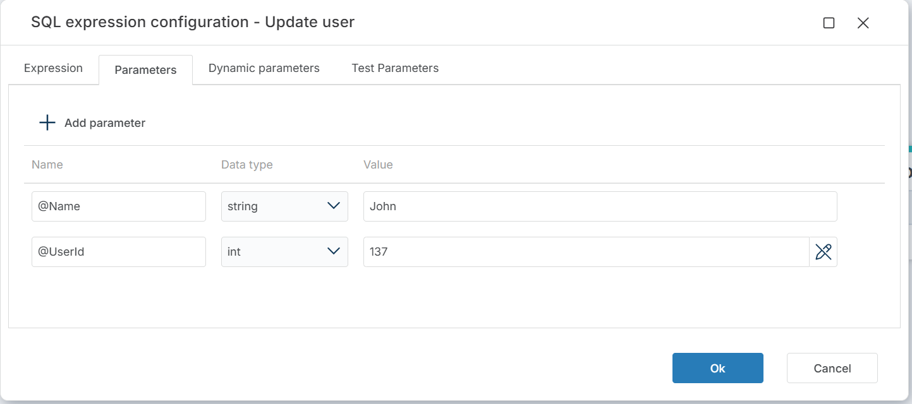

# Execute command

Executes a SQL command against a SQL Server database and returns the number of rows affected. Use this for `INSERT`, `UPDATE`, `DELETE`, `MERGE`, stored procedure calls, or any other statement that does not return a result set.

> [!NOTE]
> This action returns the row count, not query results. To retrieve data, use [Get DataReader](./get-datareader.md) or [Get Single Value](./get-single-value.md).

## When to use this

- To run `UPDATE` or `DELETE` statements that cannot be expressed with the dedicated [Merge Tables](./merge-tables.md) or [Delete Table](./delete-table.md) actions.
- To call stored procedures that perform data modifications.
- To run DDL statements (`ALTER TABLE`, `CREATE INDEX`, etc.) not covered by other SQL Server actions.
- To execute a custom `MERGE` statement when the [Merge Tables](./merge-tables.md) configuration editor is too limited.

## How it works

- **Input**: A SQL command (with optional parameters) and a SQL Server connection.
- **Processing**: Executes the command against the connected database. Supports parameterized queries and Flow variable interpolation in the command text (see [How to use parameters](#how-to-use-parameters) and [How to use Flow variables](#how-to-use-flow-variables-in-the-command-expression) below).
- **Output**: Returns the number of rows affected as an `Int32`. If **Result variable name** is set, the count is also stored in the specified Flow variable for use by downstream actions.




**Example**   
This flow archives and then removes completed orders. **Archive completed orders** copies rows matching `Status = 'Completed'` from `Orders` to `Orders_Archive` using an `INSERT INTO ... SELECT` statement. **Delete archived orders** then removes the same rows from `Orders` with a `DELETE` statement. Use Execute Command when you need SQL statements that go beyond what the dedicated actions ([Merge Tables](./merge-tables.md), [Delete Table](./delete-table.md)) support.

<br/>

## Properties

| Name         | Required | Description                                       |
|--------------|----------|---------------------------------------------------|
| **Title**           | No | A descriptive title for the action.        |
| **Connection**      | Yes | The [SQL Server Connection](./connection.md) to the target database.         |
| **Enable dynamic connection** | No | When enabled, uses a connection created at runtime by [Create Connection](./create-connection.md). Use this when the target database varies between runs. |
| **SQL expression and parameters**   | Yes | The SQL command to execute, with optional parameters. Supports parameterized queries and Flow variable interpolation. See [How to use parameters](#how-to-use-parameters) and [How to use Flow variables](#how-to-use-flow-variables-in-the-command-expression) below. |
| **Result variable name** | No | The name of a Flow variable that receives the number of rows affected. Use this to pass the count to downstream actions or conditions. |
| **Command timeout (seconds)** | No | Maximum execution time in seconds. The action fails with a timeout error if exceeded. Default is 120 seconds. |
| **Disabled** | No | When checked, the action is skipped during Flow execution. |
| **Description**   | No | Additional notes or comments about the action or configuration. |

<br/>

## Returns

[Int32](https://learn.microsoft.com/en-us/dotnet/api/system.int32). The number of rows affected by the command. For statements that do not affect rows (e.g. DDL), returns `0` or `-1` depending on the statement type.

<br/>

## How to use parameters

Click the edit icon next to **SQL expression and parameters** to open the SQL expression editor. The editor has four tabs:

| Tab | Description |
|-----|-------------|
| **Expression** | The SQL command to execute. Write or paste your query here. |
| **Parameters** | Declare SQL parameters (`@Name`, `@UserId`) and assign values or map them to Flow variables. |
| **Dynamic parameters** | Map parameters dynamically from upstream action outputs. |
| **Test Parameters** | Provide test values to run the query in the editor with **Execute query** without affecting production data. |

The **Object Explorer** on the right lists available database objects (Tables, Views, Synonyms, Stored Procedures, Functions) on the current connection.



Declare parameters in the **Parameters** tab and reference them in the query with the `@` prefix.



Each parameter has three fields:

| Field | Description |
|-------|-------------|
| **Name** | The parameter name, including the `@` prefix (e.g. `@Name`, `@UserId`). Must match the parameter used in the SQL expression. |
| **Data type** | The parameter's data type (e.g. `string`, `int`, `decimal`). |
| **Value** | The parameter value. Enter a static value or click the field to pick from available **Flow Variables** or **Workspace Variables**. |

```sql
UPDATE Users SET [Name] = @Name WHERE UserId = @UserId
```


<br/>

## How to use Flow variables in the command expression

To use Flow variables in the SQL command, first [declare a variable](../built-in/declare-variable.md) as `Global` and [assign a value](../built-in/set-variable.md) in a preceding action. Then enclose the variable name in curly brackets in the command text.

```sql
-- TableName is a Flow variable declared and assigned in a previous action.
UPDATE {TableName} SET [Name] = @Name WHERE UserId = @UserId
```

> [!IMPORTANT]
> Flow variables in curly brackets are interpolated into the command text before execution. Use SQL parameters (`@Name`) for user-supplied values to prevent SQL injection. Use Flow variables (`{TableName}`) only for identifiers like table or column names that cannot be parameterized.

<br/>

## Code examples

### INSERT with SELECT

```sql
INSERT INTO Orders_Archive (OrderId, CustomerId, Amount, OrderDate)
SELECT OrderId, CustomerId, Amount, OrderDate
FROM Orders
WHERE Status = 'Completed'
```

### Conditional DELETE

```sql
DELETE FROM Invoices WHERE DueDate < DATEADD(YEAR, -7, GETDATE())
```

### Calling a stored procedure

```sql
EXEC dbo.RecalculateBalances @AccountId = @AccountId, @Period = @Period
```

### DDL statement

```sql
CREATE INDEX IX_Orders_CustomerId ON Orders (CustomerId)
```

### Using Result variable name

Set **Result variable name** to `rowsAffected`. Downstream actions can reference this variable — for example, a conditional branch that checks whether any rows were modified:

```
rowsAffected > 0
```

## See also

- [Get DataReader](./get-datareader.md) — executes a query and returns a result set as a DataReader.
- [Get Single Value](./get-single-value.md) — executes a query and returns a single scalar value.
- [For Each Row from Query](./for-each-row-from-query.md) — executes a query and iterates over each row.
- [Merge Tables](./merge-tables.md) — merges source rows into a target table without custom SQL.
- [Connection](./connection.md) — how to set up a SQL Server connection.

<br/>

[!INCLUDE[](__videos.md)]