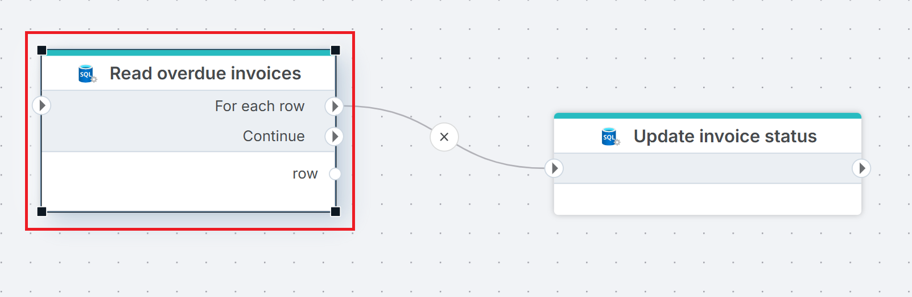
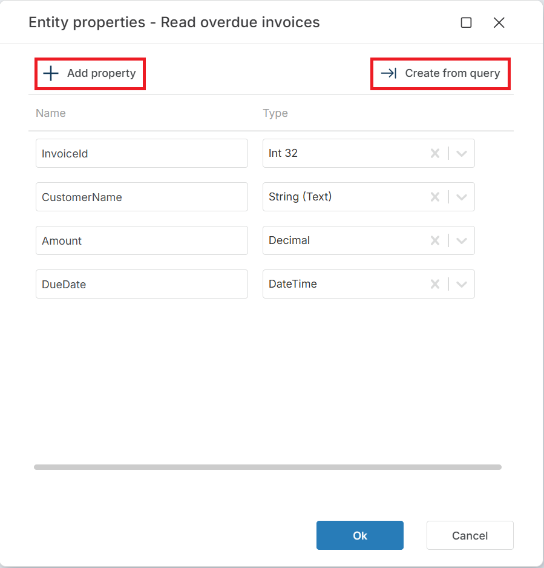

# For each row from query

Executes a SQL query and iterates over each row in the result set, running connected downstream actions once per row. Each row is mapped to a typed entity object and exposed as a Flow variable that downstream actions can reference.

Use this when you need to process query results row by row — for example, to send a notification per record, update rows individually based on calculated logic, or call an external API for each result.

## When to use this

- To process each row from a query individually — updating records, sending notifications, or calling APIs per row.
- To iterate over a filtered result set and run conditional logic on each row.
- When row-level processing is required and bulk operations ([Execute Command](./execute-command.md), [Merge Tables](./merge-tables.md)) cannot express the needed logic.

> [!TIP]
> If you need to process query results as a single batch rather than row by row, use [Get DataReader](./get-datareader.md) instead.

## How it works

- **Input**: A SQL query (with optional parameters) and a row-to-entity mapping that defines how result columns map to entity properties.
- **Processing**: Executes the query, then iterates over each row. For each row, the mapped entity is assigned to the variable specified in **Row variable name** and the actions connected to the **For each row** output port run. After all rows are processed, execution continues from the **Continue** output port.
- **Output**: No return value. The row entity is available as a Flow variable during each iteration.



**Example**   
This flow reads overdue invoices and marks each one as reminded. **Read overdue invoices** queries the `Invoices` table for rows where `DueDate` is in the past and `Status` is `Pending`. For each row, [Execute Command](./execute-command.md) updates the invoice status to `Reminded` using the `InvoiceId` from the current row entity. Use this pattern when you need to process query results one row at a time — applying per-row logic that cannot be expressed as a single bulk statement.

<br/>

## Properties

| Name         | Required | Description                                       |
|--------------|----------|---------------------------------------------------|
| **Title**           | No | A descriptive title for the action.     |
| **Connection**      | Yes | The [SQL Server Connection](./connection.md) to the target database.         |
| **Enable dynamic connection** | No | When enabled, uses a connection created at runtime by [Create Connection](./create-connection.md). Use this when the target database varies between runs. |
| **SQL expression and parameters**   | Yes | The SQL query to execute, with optional parameters. Supports parameterized queries and Flow variable interpolation. See [Execute Command — How to use parameters](./execute-command.md#how-to-use-parameters) for syntax. |
| **Row to entity mapping** | Yes | Defines how result columns map to entity properties. Click the edit icon to open the mapping editor and configure each column's name, property name, and data type. |
| **Row variable name** | No | The name of the Flow variable that holds the current row entity during each iteration. Default is `row`. Downstream actions reference this variable to access column values. |
| **Row data type** | No | The name of the generated entity type. Default is `SQLServer_ReadRows_Row`. Change this if you need multiple For each row from query actions in the same Flow with different schemas. |
| **Command timeout (seconds)** | No | Maximum execution time in seconds. The action fails with a timeout error if exceeded. Default is 120 seconds. |
| **Disabled** | No | When checked, the action is skipped during Flow execution. |
| **Description**   | No | Additional notes or comments about the action or configuration. |

<br/>

### Row to entity mapping

Click the edit icon next to **Row to entity mapping** to open the entity properties editor. You can define properties manually with **+ Add property**, or click **Create from query** to generate the mapping automatically from the columns returned by the SQL query.

Each property has two fields:

| Field | Description |
|-------|-------------|
| **Name** | The property name on the row entity. Downstream actions reference this name to access the column value (e.g. `row.Amount`). |
| **Type** | The .NET data type for the property. Nullable types are available for columns that can contain `NULL` (e.g. `Decimal? (Nullable)`). |

> [!TIP]
> Use **Create from query** to avoid manual mapping. It reads the SQL query from **SQL expression and parameters**, executes it, and generates the property list from the result columns automatically.



## Returns

No direct return value. During each iteration, the current row entity is available as a Flow variable (default name: `row`). After all rows are processed, execution continues from the **Continue** output port.

If the query returns no rows, the **For each row** port never fires and execution proceeds directly to **Continue**.

## Code examples

### Basic query with filter

```sql
SELECT InvoiceId, CustomerName, Amount, DueDate
FROM Invoices
WHERE DueDate < GETDATE() AND Status = 'Pending'
```

### Query with SQL parameters

Use SQL parameters to pass values from Flow variables into the query. Declare parameters in the **SQL expression and parameters** editor.

```sql
SELECT OrderId, ProductName, Quantity
FROM Orders
WHERE CustomerId = @CustomerId AND OrderDate >= @StartDate
```

### Referencing row properties in downstream actions

The row entity is available by the name specified in **Row variable name** (default: `row`). In a downstream [Execute Command](./execute-command.md), reference row properties as SQL parameters:

```sql
-- In the downstream Execute Command action,
-- @InvoiceId is mapped to row.InvoiceId automatically.
UPDATE Invoices SET Status = 'Reminded' WHERE InvoiceId = @InvoiceId
```

> [!NOTE]
> Parameter names in the downstream action must match the property names defined in **Row to entity mapping**. If the mapping defines `InvoiceId`, the parameter must be `@InvoiceId`.

## See also

- [Get DataReader](./get-datareader.md) — executes a query and returns the full result set as a DataReader for batch processing.
- [Get Single Value](./get-single-value.md) — executes a query and returns a single scalar value.
- [Execute Command](./execute-command.md) — executes a SQL command without returning results.
- [Get Entity](./get-entity.md) — retrieves a single entity from a query.
- [Get Entities](./get-entities.md) — retrieves multiple entities from a query as a collection.
- [Connection](./connection.md) — how to set up a SQL Server connection.

<br/>

[!INCLUDE[](__videos.md)]