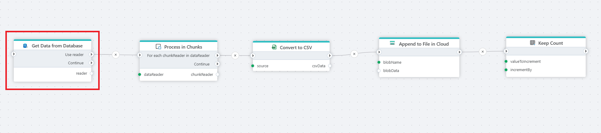

# Get DataReader

Executes a SQL query and returns a forward-only [DataReader](https://learn.microsoft.com/en-us/dotnet/api/system.data.sqlclient.sqldatareader) stream for reading rows from a SQL Server database. The DataReader is exposed as a Flow variable that downstream actions consume — for chunked processing, CSV export, data transformation, or loading into another table.

Use this when you need to pass a full result set to another action rather than iterating row by row.

## When to use this

- To read a large result set and pass it to a chunking action for batch processing (e.g. CSV export in chunks to blob storage).
- To feed query results into actions that accept a DataReader as input, such as data transformation or bulk insert actions.
- When you need streaming access to query results without loading the entire result set into memory.

> [!NOTE]
> A DataReader is forward-only — it can be read once. If you need to iterate over rows individually with per-row logic, use [For Each Row from Query](./for-each-row-from-query.md) instead.

## How it works

- **Input**: A SQL query (with optional parameters) and a SQL Server connection.
- **Processing**: Executes the query and opens a DataReader stream. The reader is assigned to the Flow variable specified in **Reader variable name**. Actions connected to the **Use reader** output port run while the reader is open.
- **Output**: Returns an [IDataReader](https://learn.microsoft.com/en-us/dotnet/api/system.data.idatareader). After all connected actions complete, the reader is closed and execution continues from the **Continue** output port.

 

**Example**   
This flow exports database rows to a CSV file in cloud storage, processing the data in chunks to handle large result sets. **Get Data from Database** executes the query and exposes the result as a DataReader. [DataReader Chunker](../built-in/datareader-chunker.md) splits the stream into smaller batches. For each chunk, [Create CSV File as Byte Array](../csv/create-csv-file-as-byte-array.md) serializes the rows to CSV format, and [Append to Blob](../azure-blob-storage/append-to-blob.md) appends the data to a file in blob storage. Use this pattern for large exports where loading the entire result set into memory is not practical.

 

## Properties

| Name         | Required | Description                                       |
|--------------|----------|---------------------------------------------------|
| **Title**           | No | A descriptive title for the action.     |
| **Connection**      | Yes | The [SQL Server Connection](./connection.md) to the target database.         |
| **Enable dynamic connection** | No | When enabled, uses a connection created at runtime by [Create Connection](./create-connection.md). Use this when the target database varies between runs. |
| **SQL expression and parameters**   | Yes | The SQL query to execute, with optional parameters. Supports parameterized queries and Flow variable interpolation. See [Execute Command — How to use parameters](./execute-command.md#how-to-use-parameters) for syntax. |
| **Reader variable name** | No | The name of the Flow variable that holds the DataReader. Default is `reader`. Downstream actions reference this variable to consume the result stream. |
| **Command timeout (seconds)** | No | Maximum execution time in seconds. The action fails with a timeout error if exceeded. Default is 120 seconds. |
| **Disabled** | No | When checked, the action is skipped during Flow execution. |
| **Description**   | No | Additional notes or comments about the action or configuration. |

 

## Returns

[IDataReader](https://learn.microsoft.com/en-us/dotnet/api/system.data.idatareader). A forward-only stream of rows from the executed query. The reader remains open while actions connected to the **Use reader** port execute, and is closed automatically when they complete. If the query returns no rows, the DataReader is empty (open but yields no records).

## See also

- [For Each Row from Query](./for-each-row-from-query.md) — iterates over rows one at a time with per-row logic.
- [Get Single Value](./get-single-value.md) — returns a single scalar value from a query.
- [Execute Command](./execute-command.md) — executes a SQL command without returning results.
- [Connection](./connection.md) — how to set up a SQL Server connection.

 

[!INCLUDE]