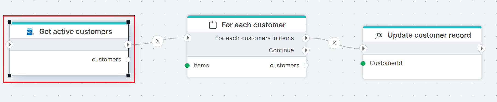
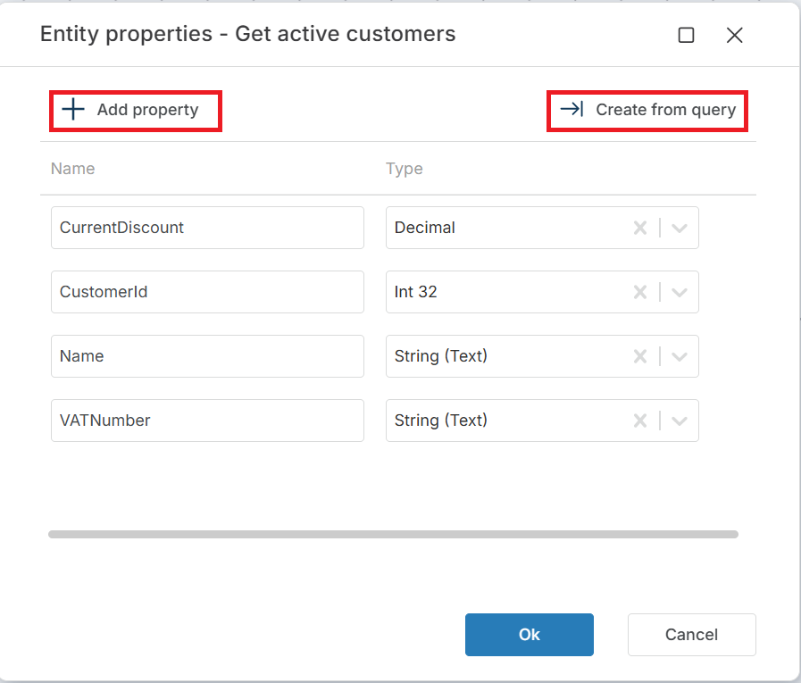

# Get entities

Executes a SQL query against a SQL Server database and returns the results as a typed list of .NET entity objects. Each row in the result set is mapped to an entity with properties defined in the **Entity properties** configuration.

Use this when you need the full query result as a strongly-typed collection that downstream actions can iterate over, filter, or transform — for example, to modify each entity in a Function action and then save the changes back.

An entity is a .NET object with one or more properties:

```csharp
public record Customer(string VATNumber, string Name, string Address);
```

This action returns a list of such entities:

```csharp
List<Customer> customers;
```

## When to use this

- To retrieve a collection of records from a query and pass them as a typed list to downstream actions for transformation or processing.
- When you need random access to the full result set (unlike [Get DataReader](./get-datareader.md) which is forward-only).
- To feed a list of entities into a ForEach loop where each entity is modified by a Function action.

> [!NOTE]
> This action loads all results into memory as a list. For large result sets, consider [Get DataReader](./get-datareader.md) with chunked processing instead.

## How it works

- **Input**: A SQL query (with optional parameters), an entity name, and an entity properties mapping that defines how result columns map to entity properties.
- **Processing**: Executes the query, maps each result row to a typed entity object, and collects all entities into a list.
- **Output**: Returns the list as a Flow variable specified in **Result variable name**. The type is `List<EntityName>` where `EntityName` is the value of **Entity name**.


<br/>



**Example**   
This flow recalculates discounts for active customers. **Get active customers** queries the `Customers` table and returns a `List<CustomerEntity>` in the `customers` variable. [For Each](../built-in/foreach.md) iterates over the list, and for each entity [Function](../built-in/function.md) applies the recalculation logic in **Update customer record**. Use this pattern when you need the full result set as a typed collection — for example, when downstream actions reference entity properties directly in code.

<br/>

## Properties

| Name         | Required | Description                                       |
|--------------|----------|---------------------------------------------------|
| **Title**           | No | A descriptive title for the action.     |
| **Connection**      | Yes | The [SQL Server Connection](./connection.md) to the target database.         |
| **Enable dynamic connection** | No | When enabled, uses a connection created at runtime by [Create Connection](./create-connection.md). Use this when the target database varies between runs. |
| **SQL expression and parameters**   | Yes | The SQL query to execute, with optional parameters. Supports parameterized queries and Flow variable interpolation. |
| **Entity name** | No | The name of the generated entity type (e.g. `MyCustomerEntity`). This becomes the class name of the mapped .NET object. |
| **Entity properties** | Yes | Defines how result columns map to entity properties. Click the edit icon to open the mapping editor. See [Entity properties](#entity-properties) below. |
| **Result variable name** | Yes | The name of the Flow variable that holds the returned list. Default is `entities`. Downstream actions reference this variable to access the entity collection. |
| **Result data type** | No | The generated type name for the list (e.g. `List<MyCustomerEntity>`). Derived automatically from **Entity name**. |
| **Command timeout (seconds)** | No | Maximum execution time in seconds. The action fails with a timeout error if exceeded. Default is 120 seconds. |
| **Disabled** | No | When checked, the action is skipped during Flow execution. |
| **Description**   | No | Additional notes or comments about the action or configuration. |


<br/>


### Entity properties

Click the edit icon next to **Entity properties** to open the entity properties editor. You can define properties manually with **+ Add property**, or click **Create from query** to generate the mapping automatically from the query result columns.

Each property has two fields:

| Field | Description |
|-------|-------------|
| **Name** | The property name on the entity object (e.g. `CustomerId`, `Name`). Must match or map to a column in the query result. |
| **Type** | The .NET data type for the property (e.g. `String (Text)`, `Int 32`, `Decimal`). Nullable types are available for columns that can contain `NULL`. |

> [!TIP]
> Use **Create from query** to avoid manual mapping. It executes the SQL query and generates the property list from the result columns automatically.


<br/>

## Returns

A [List\<T\>](https://learn.microsoft.com/en-us/dotnet/api/system.collections.generic.list-1) of typed entity objects with properties specified by the **Entity properties** configuration. If the query returns no rows, the list is empty (zero items, not null).

## See also

- [Get Entity](./get-entity.md) — retrieves a single entity from a query (first row only).
- [For Each Row from Query](./for-each-row-from-query.md) — iterates over rows one at a time without loading the full result into memory.
- [Get DataReader](./get-datareader.md) — returns a forward-only stream for large result sets.
- [Get Single Value](./get-single-value.md) — returns a single scalar value from a query.
- [Connection](./connection.md) — how to set up a SQL Server connection.

<br/>

[!INCLUDE[](__videos.md)]