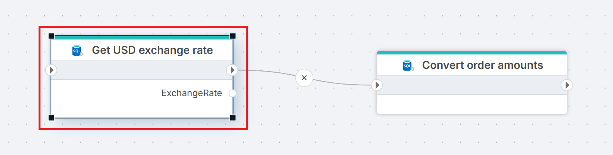

# Get entity

Executes a SQL query against a SQL Server database and returns the first row as a single typed .NET entity object. Each column in the result is mapped to an entity property defined in the **Entity properties** configuration.

Use this when you need exactly one record from a query — for example, to look up a configuration value, retrieve a single customer by ID, or fetch the latest row matching a condition.

An entity is a .NET object with one or more properties:

```csharp
public record Customer(string VATNumber, string Name, string Address);
```

## When to use this

- To retrieve a single record by primary key or unique filter for use in downstream actions.
- To look up a configuration or settings row that a Function action needs to reference.
- When you expect one row and want a typed object, not a DataReader or scalar value.

> [!NOTE]
> This action returns the first row from the result set. If the query returns multiple rows, only the first is mapped. Use `TOP 1` or a unique filter to make this explicit.

## How it works

- **Input**: A SQL query (with optional parameters) and an entity properties mapping that defines how result columns map to entity properties.
- **Processing**: Executes the query, takes the first row from the result set, and maps it to a typed entity object.
- **Output**: Returns the entity as a Flow variable specified in **Result variable name**. Downstream actions reference the variable to access property values (e.g. `entity.Name`).


<br/>



**Example**   
This flow looks up the current USD exchange rate and applies it to unconverted orders. **Get USD exchange rate** retrieves the most recent rate from the `ExchangeRates` table as a single entity in the `ExchangeRate` variable. [Execute Command](./execute-command.md) then uses the `Rate` property to update all USD orders that have not yet been converted. Use Get entity when you need a single lookup value — a configuration row, a rate, or a record by ID — that downstream actions consume.
<br/>

## Properties

| Name         | Required | Description                                       |
|--------------|----------|---------------------------------------------------|
| **Title**           | No | A descriptive title for the action.     |
| **Connection**      | Yes | The [SQL Server Connection](./connection.md) to the target database.         |
| **Enable dynamic connection** | No | When enabled, uses a connection created at runtime by [Create Connection](./create-connection.md). Use this when the target database varies between runs. |
| **SQL expression and parameters**   | Yes | The SQL query to execute, with optional parameters. Supports parameterized queries and Flow variable interpolation. |
| **Entity name** | No | The name of the generated entity type (e.g. `MyEntity`). This becomes the class name of the mapped .NET object. |
| **Entity properties** | Yes | Defines how result columns map to entity properties. Click the edit icon to open the mapping editor. See [Entity properties](#entity-properties) below. |
| **Result variable name** | No | The name of the Flow variable that holds the returned entity. Default is `entity`. Downstream actions reference this variable to access property values. |
| **Command timeout (seconds)** | No | Maximum execution time in seconds. The action fails with a timeout error if exceeded. Default is 120 seconds. |
| **Disabled** | No | When checked, the action is skipped during Flow execution. |
| **Description**   | No | Additional notes or comments about the action or configuration. |

<br/>

### Entity properties

Click the edit icon next to **Entity properties** to open the entity properties editor. You can define properties manually with **+ Add property**, or click **Create from query** to generate the mapping automatically from the query result columns.

Each property has two fields:

| Field | Description |
|-------|-------------|
| **Name** | The property name on the entity object (e.g. `VATNumber`, `Name`, `Address`). Must match or map to a column in the query result. |
| **Type** | The .NET data type for the property (e.g. `String (Text)`, `Int 32`). Nullable types are available for columns that can contain `NULL`. |

> [!TIP]
> Use **Create from query** to avoid manual mapping. It executes the SQL query and generates the property list from the result columns automatically.

<br/>

## Returns

A single .NET entity object with properties specified by the **Entity properties** configuration. If the query returns no rows, the variable is `null` — downstream actions that reference the entity should handle this case.

## See also

- [Get Entities](./get-entities.md) — retrieves multiple entities as a typed list.
- [Get Single Value](./get-single-value.md) — returns a single scalar value from a query.
- [For Each Row from Query](./for-each-row-from-query.md) — iterates over rows one at a time.
- [Get DataReader](./get-datareader.md) — returns a forward-only stream for large result sets.
- [Connection](./connection.md) — how to set up a SQL Server connection.

<br/>

[!INCLUDE[](__videos.md)]