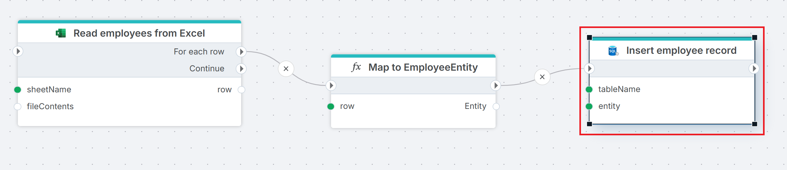

# Insert entity

Inserts a single row into a SQL Server table using data from a typed entity object. Each property on the entity maps to a column in the target table by name.

Use this when you have a typed entity — for example, created by a Function action — and want to insert it as a new row.

Logically, this action performs:

```sql
INSERT INTO tableName (Property1, Property2) VALUES(entity.Property1, entity.Property2)
```

> [!NOTE]
> Each property name on the entity must match a column in the target table. If the database collation is case-sensitive, property names and column names must also match by case.

## When to use this

- To insert a single typed entity created by a Function action or received from an upstream action.
- To save records from an Excel import where each row is mapped to an entity before insertion.
- When you have a structured object and want a clean insert without writing SQL.

> [!TIP]
> To insert or update based on whether the row already exists, use [Insert or Update Row](./insert-or-update-row.md) instead. To insert many rows in bulk, use [Insert Rows](./insert-data.md).

## How it works

- **Input**: A typed entity object and the name of the target table.
- **Processing**: Maps each property on the entity to a column in the target table by name and inserts a new row with those values.
- **Output**: Optionally stores the number of rows affected in a Flow variable specified by **Result variable name**.



**Example**   
This flow [reads employee data from an Excel file](../excel/for-each-row.md) and iterates over rows in the spreadsheet. For each row, [Map to EmployeeEntity](../built-in/function.md) creates a typed entity from the row data. **Insert employee record** then inserts the entity as a new row in the target table. Use this pattern when source data needs transformation before insertion — the Function action shapes the data into an entity, and Insert entity writes it to the database.

<br/>

## Properties

| Name         | Required | Description                                       |
|--------------|----------|---------------------------------------------------|
| **Title**              | No | A descriptive title for the action.               |
| **Connection**      | Yes | The [SQL Server Connection](./connection.md) to the target database.         |
| **Enable dynamic connection** | No | When enabled, uses a connection created at runtime by [Create Connection](./create-connection.md). Use this when the target database varies between runs. |
| **Entity** | Yes | The entity object to insert. Select from available Flow variables — typically an entity created by a Function or Get Entity action. |
| **Table name** | Yes | The name of the table to insert the row into. |
| **Result variable name** | No | The name of a Flow variable that receives the number of rows affected. |
| **Command timeout (seconds)** | No | Maximum execution time in seconds. The action fails with a timeout error if exceeded. Default is 120 seconds. |
| **Disabled** | No | When checked, the action is skipped during Flow execution. |
| **Description**   | No | Additional notes or comments about the action or configuration. |

<br/>

## Returns

[Int32](https://learn.microsoft.com/en-us/dotnet/api/system.int32). The number of rows affected (typically `1` for a successful insert). If **Result variable name** is set, the value is stored in the specified Flow variable.

## See also

- [Update Entity](./update-entity.md) — updates an existing row from a typed entity object.
- [Insert or Update Row](./insert-or-update-row.md) — upserts a single row based on key match.
- [Insert Rows](./insert-data.md) — bulk-inserts rows from a DataReader or DataTable.
- [Get Entity](./get-entity.md) — retrieves a single entity from a query.
- [Connection](./connection.md) — how to set up a SQL Server connection.

<br/>

[!INCLUDE[](__videos.md)]