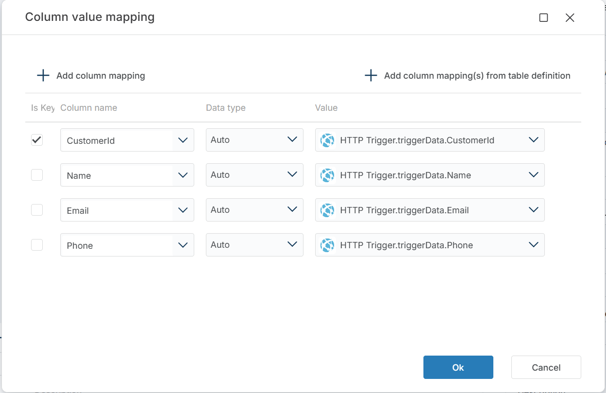

# Insert or update row

Inserts a new row or updates an existing row in a SQL Server table based on column-value mappings. Returns whether the operation performed was an `INSERT` or an `UPDATE`.

Use this when you need to save a single record to the database and don't know in advance whether it already exists — for example, syncing data from an external API or processing form submissions where the same record may be created or modified.

## When to use this

- To save a record from an external source (API, webhook, form) where the row may or may not already exist in the target table.
- To upsert a single row based on key column match — inserting if new, updating if existing.
- When you need to know whether the row was inserted or updated, so downstream actions can branch on the result.

> [!NOTE]
> This action operates on a single row. To upsert multiple rows in bulk, use [Merge Tables](./merge-tables.md) instead.

## How it works

- **Input**: A table name and a column-value mapping that defines both the match key and the values to write.
- **Processing**: Checks whether a row matching the key columns exists in the target table. If it exists, updates the row with the mapped values. If not, inserts a new row.
- **Output**: Returns the string `INSERT` or `UPDATE` indicating which operation was performed. The value is stored in the Flow variable specified by **Result variable name**.

 

**Example**   
This flow syncs customer data from an external API into a SQL Server table. [HTTP Request](../http/http-request.md) fetches customer data from a web API. **Save customer data** upserts the record into the `Customers` table — inserting it if the customer is new, or updating it if the customer already exists. [Send Email](../microsoft-365-outlook/send-email.md) then sends a confirmation. Use this pattern when syncing external data where the same record may arrive as a new insert or an update to an existing row.

 

## Properties

| Name                  | Required | Description                                                                 |
|-----------------------|----------|-----------------------------------------------------------------------------|
| **Title**                 | No | A descriptive title for the action.                                         |
| **Connection**            | Yes | The [SQL Server Connection](./connection.md) to the target database.        |
| **Enable dynamic connection**    | No | When enabled, uses a connection created at runtime by [Create Connection](./create-connection.md). Use this when the target database varies between runs. |
| **Table name**            | Yes | The name of the table to insert or update the row in.                       |
| **Column value mapping**  | Yes | Defines the columns, their values, and which columns are used as match keys. See [Column value mapping](#column-value-mapping) below. |
| **Result variable name**  | No | The name of a Flow variable that receives the operation performed — either `INSERT` or `UPDATE`. Default is `operation`. Use this to branch downstream logic based on the result. |
| **Command timeout (seconds)** | No | Maximum execution time in seconds. The action fails with a timeout error if exceeded. Default is 120 seconds. |
| **Disabled** | No | When checked, the action is skipped during Flow execution. |
| **Description**           | No | Additional notes or comments about the action or configuration.              |

 

### Column value mapping

Click the edit icon next to **Column value mapping** to open the mapping editor. You can define mappings manually with **+ Add column mapping**, or click **+ Add column mapping(s) from table definition** to generate the list from the target table schema.

Each entry has four fields:

| Field | Description |
|-------|-------------|
| **Is Key** | When checked, the column is used as a match condition. The action checks if a row with this key value exists — if yes, it updates; if not, it inserts. At least one column must be marked as key. |
| **Column name** | The name of the column in the target table. |
| **Data type** | The data type of the column. Default is `Auto` (inferred from the table). |
| **Value** | The value to write. Select from available Flow Variables or upstream action outputs. |

> [!IMPORTANT]
> At least one column must have **Is Key** checked. Without a key, the action cannot determine whether to insert or update.

 

## Returns

A string value — either `INSERT` or `UPDATE` — indicating which database operation was performed. If **Result variable name** is set, the value is stored in the specified Flow variable.

## See also

- [Insert Rows](./insert-data.md) — bulk-inserts rows from a DataReader or DataTable.
- [Insert Entity](./insert-entity.md) — inserts a typed entity object as a new row.
- [Update Entity](./update-entity.md) — updates a row from a typed entity object.
- [Merge Tables](./merge-tables.md) — merges multiple rows with insert/update/delete logic.
- [Execute Command](./execute-command.md) — runs custom SQL for complex upsert scenarios.
- [Connection](./connection.md) — how to set up a SQL Server connection.

 

[!INCLUDE]