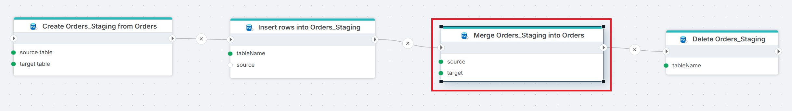
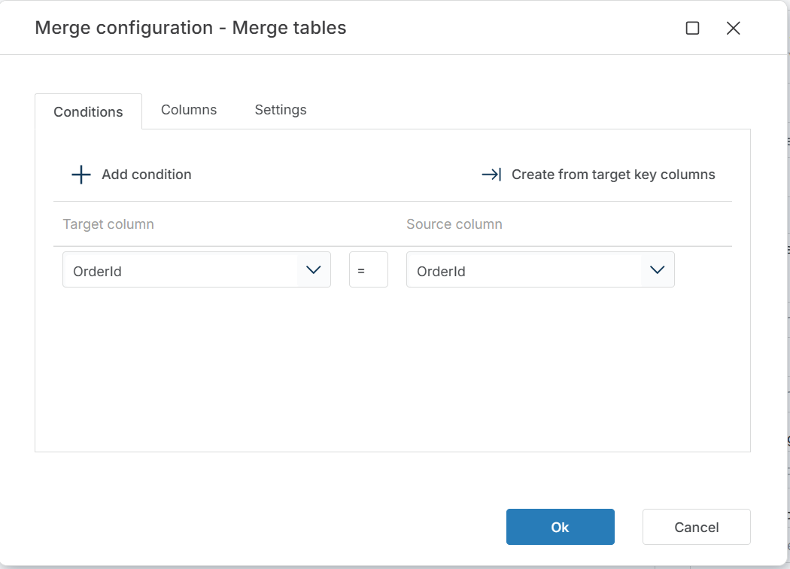
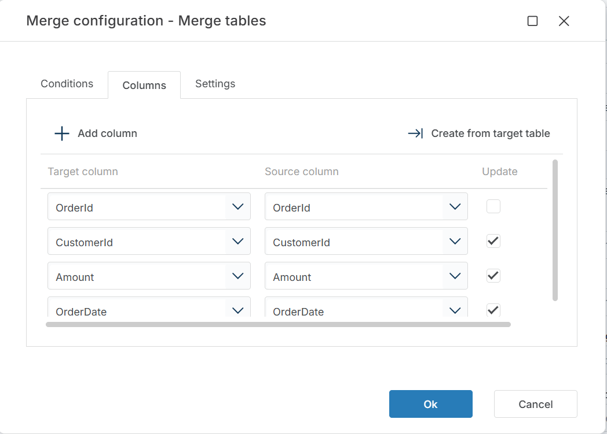
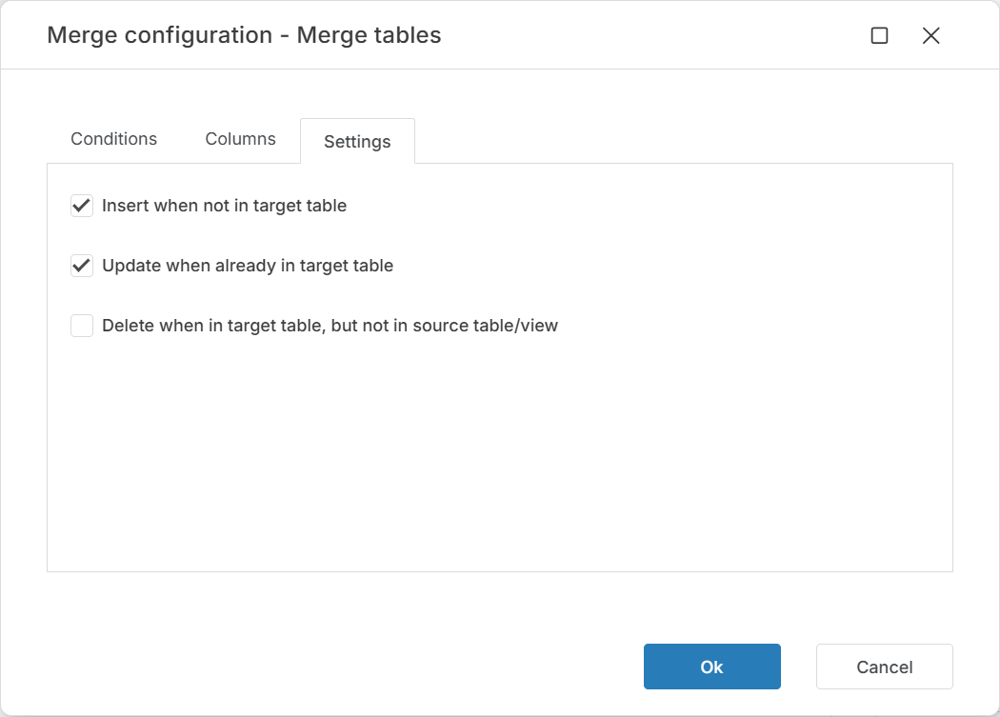

# Merge tables

Merges rows from a SQL Server source table or view into a target table using the SQL Server [MERGE](https://learn.microsoft.com/en-us/sql/t-sql/statements/merge-transact-sql) statement. Matched rows are updated, unmatched rows are inserted, and optionally rows missing from the source are deleted from the target.

Use this to synchronize a staging table with a production table — inserting new records, updating changed records, and removing deleted records in a single operation.

> [!TIP]
> This action wraps a standard `MERGE` statement. For complex merge logic with custom `WHEN` clauses or multiple match conditions, use [Execute Command](./execute-command.md) with a hand-written `MERGE` statement instead.

## When to use this

- To synchronize a staging table into a production table after an ETL load — inserting new rows and updating existing ones in one step.
- To apply incremental changes from an import table to a master table, keeping the target in sync with the source.
- To upsert data (insert or update) without writing custom SQL.

## How it works

- **Input**: A source table or view and a target table on the same connection, plus a merge configuration that defines how rows are matched and what happens on match, no match, and (optionally) when a target row has no corresponding source row.
- **Processing**: Generates and executes a `MERGE` statement based on the configured match keys and actions.
- **Output**: Optionally stores the number of affected rows in a Flow variable specified by **Result variable name**.

 

**Example**   
This flow runs a full staging cycle. [Create Table from Source](./create-table-from-source.md) clones the `Orders` schema into `Orders_Staging`. [Insert Rows](./insert-data.md) loads data into the staging table. **Merge Orders_Staging into Orders** synchronizes the staged rows into the production `Orders` table — inserting new rows and updating existing ones based on the configured match keys. [Delete Table](./delete-table.md) then drops the staging table, which is no longer needed. Use this pattern in recurring ETL Flows where staging data must be reconciled with a production table.

 

## Properties

| Name         | Required | Description                                       |
|--------------|----------|---------------------------------------------------|
| **Title**              | No | A descriptive title for the action.               |
| **Connection**      | Yes | The [SQL Server Connection](./connection.md) to the database containing both tables.         |
| **Enable dynamic connection** | No | When enabled, uses a connection created at runtime by [Create Connection](./create-connection.md). Use this when the target database varies between runs. |
| **Source**   | Yes | The name of the source table or view to merge from. |
| **Target table** | Yes | The name of the target table to merge into. |
| **Merge configuration** | Yes | Defines how rows are matched between source and target, and what happens on match, no match, and when a target row is missing from the source. See [Merge configuration](#merge-configuration) below. |
| **Result variable name** | No | The name of a Flow variable that receives the number of rows affected by the merge. Use this to pass the count to downstream actions or conditions. |
| **Command timeout (seconds)** | No | Maximum execution time in seconds. The action fails with a timeout error if exceeded. Default is 120 seconds. |
| **Disabled** | No | When checked, the action is skipped during Flow execution. |
| **Description**   | No | Additional notes or comments about the action or configuration. |

 

### Merge configuration

Click the edit icon next to **Merge configuration** to open the configuration editor. The editor has three tabs:

#### Conditions

Defines how rows are matched between source and target. Each condition pairs a target column with a source column. Rows where all conditions match are considered the same record.

Click **+ Add condition** to define match keys manually, or click **Create from target key columns** to generate conditions from the target table's primary key.

#### Columns

Defines which columns are included in the merge and which are updated when a match is found. Each entry maps a target column to a source column. The **Update** checkbox controls whether the column is overwritten when the row already exists in the target.

Click **+ Add column** to define mappings manually, or click **Create from target table** to generate the column list from the target table schema.

> [!TIP]
> Leave **Update** unchecked for key columns — updating the column you match on causes unexpected results.

#### Settings

Controls what happens for each of the three merge cases:

| Setting | Default | Description |
|---------|---------|-------------|
| **Insert when not in target table** | ☑ | Inserts source rows that have no match in the target. Corresponds to `WHEN NOT MATCHED BY TARGET THEN INSERT`. |
| **Update when already in target table** | ☑ | Updates target rows that match a source row. Only columns with **Update** checked in the Columns tab are overwritten. Corresponds to `WHEN MATCHED THEN UPDATE`. |
| **Delete when in target table, but not in source table/view** | ☐ | Deletes target rows that have no corresponding source row. Corresponds to `WHEN NOT MATCHED BY SOURCE THEN DELETE`. |

> [!WARNING]
> Enabling **Delete when in target table, but not in source table/view** removes target rows that are missing from the source. If the source contains only a partial data set, this deletes rows that should be kept. Use only when the source represents the complete data set.

 

## Returns

No direct return value. If **Result variable name** is set, the specified Flow variable receives the number of rows affected (inserted, updated, or deleted) by the merge.

## See also

- [Insert Data](./insert-data.md) — inserts rows into a table without update logic.
- [Insert or Update Row](./insert-or-update-row.md) — upserts a single row based on key match.
- [Execute Command](./execute-command.md) — runs a custom SQL statement for complex merge scenarios.
- [Truncate Table](./truncate-table.md) — clears a table before a full reload (alternative to merge for full-refresh patterns).
- [Connection](./connection.md) — how to set up a SQL Server connection.

 

[!INCLUDE]