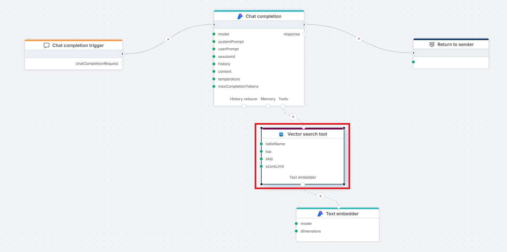
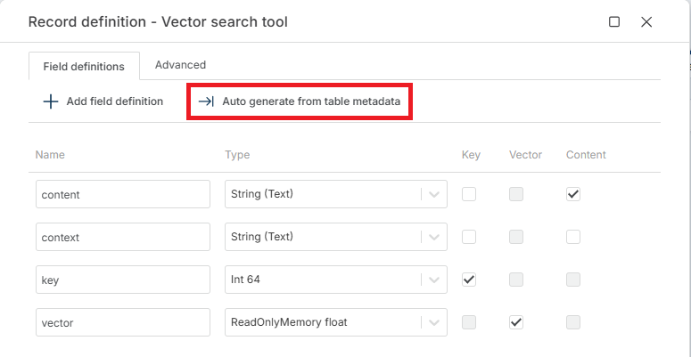

# Vector search tool

Registers a SQL Server vector similarity search as a callable tool for chat completion and AI agent actions, returning semantically relevant records as RAG context. Use this when the LLM should decide *whether and how* to retrieve context at runtime — for example, an agent that looks up an accounting policy only when a user actually asks about one.

**Example**   
This flow exposes a SQL Server **Vector search tool** to an Azure AI [Chat completion](../azure-ai/chat-completion.md) action, so the LLM can retrieve relevant context on demand. A user's question arrives through a [Chat completion](../../triggers/ai/chat-completion-trigger.md) trigger and is passed to the Chat completion action. When the LLM decides the question requires retrieval, it invokes the **Vector search tool**, which uses a connected [Text embedder](../azure-ai/text-embedder.md) to vectorize the query and performs a similarity search against the SQL Server database. The retrieved records are returned to the LLM, which generates a grounded response sent back to the client via the [Return](../built-in/return.md) node.

 

## When to use this

- Building a finance assistant that answers questions like *"What is our policy on capex thresholds above 100k?"* by retrieving relevant policy records from a SQL Server table.
- Letting an AI agent resolve business-language references (e.g. "travel expense", "consulting fees") to the correct account or cost center codes before querying actuals.
- Giving a chat agent access to historical analyst commentary on budget variances so it can reference prior notes when responding.

## Properties

| Name | Required | Description |
|---|---|---|
| Title | No | The title or name of the action. |
| Connection | Yes | The SQL Server database connection used for the search. |
| Enable dynamic connection | No | When on, the connection is resolved at runtime from an input port instead of being fixed at design time. |
| Tool name | No | The function name exposed to the LLM. Default: `rag_retrieve_context`. The LLM uses this name when deciding to call the tool. |
| Tool description | No | Description the LLM reads to decide whether to invoke this tool. Default: `Use for questions about '{Table}'`. The single biggest factor in whether the LLM calls the tool at the right time — be specific about *when* it should be used. |
| Table | Yes | The name of the table where the vector search will be performed. Must contain an embedding vector column. |
| Record definition | Yes | Defines the columns returned from the search and which column holds the **Key**, **Vector**, and **Content** roles. The vector column is not part of the returned data. See [Record definition](#record-definition) below. |
| Filter | No | A filter expression to narrow down the records before the similarity search runs (e.g. `category = 'policy'`). |
| Top | No | The maximum number of top results to return. |
| Skip | No | The number of top results to skip. Default: *0*. |
| [Distance function](https://learn.microsoft.com/en-us/azure/cosmos-db/gen-ai/distance-functions) | No | The method for calculating vector similarity. One of *Cosine Distance* (default), *Cosine Similarity*, *Dot Product Similarity*, *Euclidean Distance*, or *Manhattan Distance*. Must match the metric used when the table's embeddings were generated. |
| Score limit | No |  A threshold value that limits results to those with a distance or similarity score at or below this value. The meaningful range depends on the selected **Distance function**. Tune by observing actual scores returned for your data. |
| Command timeout (seconds) | No | The time limit for command execution before it times out. |
| Disabled | No | When on, the tool is not exposed to the LLM. Useful for temporarily removing the tool without deleting the node. |
| Description | No | Additional notes or comments about the action or configuration. |

> [!IMPORTANT]
> **Tool description** is read by the LLM, not by humans. Write it from the model's perspective: describe *when* to call the tool and *what kind of question* it answers, not what the action does internally. A vague description ("Searches a table") leads to the LLM either ignoring the tool or calling it on every turn.

#### Text embedder

The Vector search tool requires a [Text embedder](../azure-ai/text-embedder.md) connected to its bottom port. The embedder converts the LLM's query into a vector at each invocation.

> [!WARNING]
> The embedding model on the connected **Text embedder** must match the one used to populate the table's vector column. If they differ, the search still returns rows, but ranking will be effectively random. There is no runtime check for this.

#### Record definition

The record definition specifies the columns returned from the search and tells the action which column holds the key, the content, and the embedding vector. Each row in **Field definitions** is one column from the source table, with a **Name**, a **Type**, and three role checkboxes:

- **Key** — uniquely identifies the record.
- **Vector** — the column holding the pre-computed embedding used for similarity comparison. Typically of type `ReadOnlyMemory float`. Not part of the returned data.
- **Content** — the text the LLM will read to answer the question.

Use **Auto generate from table metadata** to populate Field definitions from the configured **Table** in one step, then assign the **Key**, **Vector**, and **Content** roles to the appropriate columns. Add any additional columns the LLM should see as metadata. Extra columns waste context tokens — include only what the model needs to answer.

The **Advanced** tab exposes one additional field:

- **Search result type name** — name used for the result type returned by the action. Optional. Defaults to the table name (for example, `Bid_KB_VectorData`). Set this when you need a stable, predictable type name across environments, or when multiple Vector search tools in the same Flow would otherwise produce colliding type names.

## Returns

The Vector search tool returns an [IVectorSearchResult](../../api-reference/built-in-types/ai/i-vector-search-result.md) object to the calling LLM. The LLM incorporates the result into its response — downstream Flow actions do not consume this output directly.

