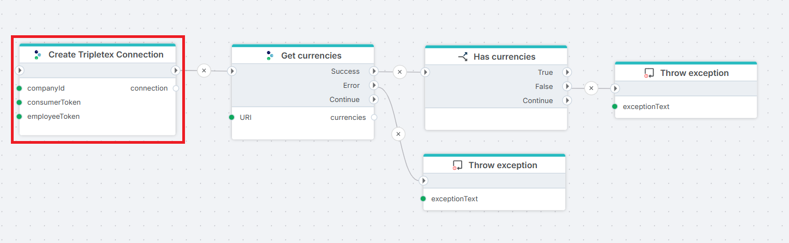

# Create Tripletex connection

Builds a Tripletex `Connection` at runtime from values you supply as inputs. Use this when the credentials for Tripletex are not configured statically in the workspace — typically because the Flow needs to choose between multiple Tripletex subscriptions per execution, or because security policy requires credentials to stay in an external store.



**Example**   
This flow verifies a dynamically built Tripletex connection end-to-end before the rest of the Flow runs against it. **Create Tripletex Connection** produces a `Connection` on its `connection` output. [Get currencies](./paged-rest-api-request.md) calls the Tripletex `currency` endpoint using that connection and exposes the result on its `currencies` output. [Has currencies](../built-in/if.md) branches on whether the list contains at least one entry. If **Get currencies** fails (network, 401, 403, 5xx), a [Throw exception](../built-in/throw-exception.md) on the Error branch reports the API failure; if the list is empty — Tripletex returns at least NOK for any active company, so an empty list signals a misconfigured connection or an inactive company — a second [Throw exception](../built-in/throw-exception.md) on the False branch reports the unexpected-empty-result case. Use this pattern as a health check at the start of any Tripletex integration: it surfaces credential, network, and configuration problems immediately rather than during the first real data operation downstream.

## Use cases

- Switching between Tripletex subscriptions per tenant, customer, or environment within a single Flow.
- Reading credentials from an external secrets store, database, or Key Vault instead of configuring them statically.
- Running the same Flow against the Tripletex test environment in development and production at deploy time.
- Acting on behalf of different client companies on different runs in accountant integrations.

If the Flow always uses the same Tripletex subscription with credentials configured once, use the static [Tripletex Connection](./tripletex-connection.md) instead and skip this action.

## How it works

- **Input:** Company ID and employee token, plus an optional consumer token override, the test-environment flag, and the variable name to expose the connection under.
- **Processing:** Builds a `Connection` object scoped to the supplied credentials and binds it to the variable named in **Connection variable name** (default `connection`). The action does not call Tripletex and does not validate the tokens. Validation happens when the first request action runs against the connection.
- **Output:** A `Connection` object accessible to downstream actions via the variable name set here. The connection lives for the duration of the Flow execution and is not persisted to the workspace.

When `Dynamic connection` is set on a Tripletex request action, the request action ignores its statically configured `Connection` and uses the one this action produced.


> [!TIP]
> Place this action immediately before the first Tripletex request action in the Flow. Reading the employee token from an upstream **Execute SQL** or **Get Secret** action and feeding it straight into **Create Tripletex Connection** keeps credentials out of the Flow definition itself.

## Prerequisites

- A Tripletex account with API access enabled.
- A **consumer token** registered for the integrating application. The static [Tripletex Connection](./tripletex-connection.md) typically holds this at the workspace level; supply it here only when overriding per execution.
- An **employee token** identifying the Tripletex user the action acts on behalf of. The employee's entitlements set the upper bound of what the connection can read and write — a too-restricted employee causes 403s in downstream request actions, not in this action.
- The **Tripletex company ID** of the subscription the connection should target. Available in the Tripletex web UI under company settings.
- For accountant integrations: client access established and entitlements assigned to the employee, per the [Tripletex authentication documentation](https://developer.tripletex.no/docs/documentation/authentication-and-tokens/).

> [!IMPORTANT]
> **Employee Token** entitlements determine what the connection can do. If the employee user has restricted permissions in Tripletex (e.g. read-only on customers, no access to ledger), downstream request actions will return 403 for forbidden endpoints — this action will succeed because it does not call Tripletex itself.

## Properties

| Property | Required | Description |
|---|---|---|
| **Title** | No | Display name of the action node on the Flowchart. Defaults to `Create Tripletex Connection`. Does not affect runtime behavior. |
| **Company ID** | Yes | Tripletex company ID the connection targets. Selectable from a dropdown, or entered directly when the value comes from an upstream action. |
| **Consumer Token** | No | Token identifying the calling application. Leave empty to use the consumer token configured on the static Tripletex Connection at workspace level; set it here to override per execution (for example when one Flow integrates with two registered applications). |
| **Employee Token** | Yes | Token identifying the Tripletex employee the action acts on behalf of. Its entitlements set the upper bound of what the connection can read and write. |
| **Connection variable name** | No | Variable name under which the resulting `Connection` object is exposed to downstream actions. Defaults to `connection`. Change it only when the Flow creates multiple connections and needs distinct names. |
| **Use demo URL's** | No | Routes requests to the Tripletex test environment (`api-test.tripletex.tech`) instead of production (`tripletex.no`). Test-environment tokens only work with this enabled; production tokens only work with it disabled. |
| **Description** | No | Free-text notes about the action. Not used at runtime. |

<!-- TODO: Confirm that Consumer Token, when left empty, falls back to a workspace-level consumer token from the static Tripletex Connection. The "(optional)" placeholder strongly implies a fallback, but the exact source of that fallback should be documented explicitly. -->

<!-- TODO: Confirm the exact label "Use demo URL's" (with the apostrophe). The static connection page uses "Use Tripletex test environment" for the equivalent setting. If both labels exist in the product, document the relationship; if one is stale, align both pages on the current label. -->


## Returns

Builds a `Connection` object scoped to the supplied credentials and assigns it to the variable named in **Connection variable name**. The object is valid only for the current Flow execution; it is not added to the workspace and cannot be selected from the **Connection** dropdown on other Flows.

## Configuration

### Consumer Token

Leave this empty in most setups. The static [Tripletex Connection](./tripletex-connection.md) at workspace level holds the consumer token issued to the integrating application, and this action inherits it.

Set the field here only when one Flow needs to act on behalf of two different registered applications (rare, typically only when running a migration between two consumer registrations).

### Use demo URL's

| Token type | Use demo URL's | Result |
|---|---|---|
| Production (`tripletex.no`) | Disabled | Works. Requests go to production. |
| Production | Enabled | 401 from the test environment — production tokens are not valid there. |
| Test (`api-test.tripletex.tech`) | Enabled | Works. Requests go to the test environment. |
| Test | Disabled | 401 from production — test tokens are not valid there. |

The same `Connection` cannot serve both environments. Switching environments mid-Flow requires a second **Create Tripletex Connection** action with a different value for this flag.

### Connection variable name

Defaults to `connection`. Override only when the Flow creates two or more Tripletex connections that need to be distinguishable downstream — for example a Flow that reads from one Tripletex subscription and writes to another:

```
connection_source
connection_target
```

## See also

- [Tripletex Connection](./tripletex-connection.md) — the static `Connection` configured once in the workspace and selected from the **Connection** dropdown on request actions. Holds the consumer token that this action falls back to.
- [REST API Request with paging](./paged-rest-api-request.md) — the most common consumer of the connection this action produces.
- [Tripletex authentication documentation](https://developer.tripletex.no/docs/documentation/authentication-and-tokens/) — how to obtain consumer and employee tokens, including the accountant-token flow.
