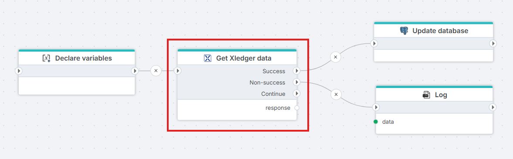

# Get Xledger data

The **Get Xledger data** action executes a GraphQL query against the Xledger API and returns the response data. Use it to read any data available through the Xledger GraphQL schema — accounts, transactions, projects, employees, subledger entries, and more.




**Example**   
This flow downloads the list of accounts from Xledger and loads it into a downstream database. [Declare variables](../built-in/declare-variables.md) initialises four inputs — `xledgerEnvironment`, `productionApiKey`, `testApiKey`, and `demoApiKey`. [Create Xledger connection](create-connection.md) consumes them and emits a `Connection` on its `dynamicConnection` output port. **Get accounts** runs a GraphQL query against the Xledger `accounts` endpoint using that connection (bound to its **Dynamic connection** property) and exposes the deserialised result on `xledgerResponse`. On **Success**, the response is passed to [Insert accounts in database](../built-in/function.md), which writes the accounts to the target table. On **Non-success** — invalid API key, GraphQL error, rate limit exceeded — the [Throw exception](../built-in/throw-exception.md) handler receives the `errors` collection and raises a readable failure. This pattern — dynamic connection → GraphQL read → Success/Non-success split → typed downstream consumer — is the standard shape for any Xledger extract that needs to switch between environments per execution.

## Properties

| Property | Required | Description |
|---|---|---|
| Title | No | Display name shown on the flowchart canvas |
| Connection | No* | The [Xledger connection](connecting-to-xledger.md) providing API credentials |
| Use dynamic connection | No | When enabled, the value from **Dynamic connection** is used at runtime instead of the static **Connection** |
| Dynamic connection | No* | A variable or expression that resolves to an Xledger connection at runtime. Requires the [Create Xledger connection](create-connection.md) action |
| Query | Yes | The GraphQL query string to execute against the Xledger API |
| Variables | No | GraphQL variables passed along with the query as key-value pairs |
| Return type definition | No | C# record type definition describing the shape of the expected response data |
| Disabled | No | When enabled, the action is skipped during flow execution |
| Description | No | Free-text notes |

*At least one of **Connection** or **Dynamic connection** must be configured.

## Configuration

### Query

Write a standard GraphQL query targeting the Xledger schema. The interactive Xledger GraphQL explorer is available at `https://www.xledger.net/GraphQL` (requires Administrator, Domain Administrator, or Implementation Manager role in Xledger). For test environments, use `https://test.xledger.net/GraphQL`.

**Example — fetch accounts with pagination support:**

```graphql
query($first: Int, $after: String) {
  accounts(first: $first, after: $after) {
    pageInfo {
      hasNextPage
      endCursor
    }
    edges {
      node {
        dbId
        code
        description
      }
    }
  }
}
```

### Variables

Add one row per GraphQL variable. Variables allow you to pass dynamic values into a query without modifying the query string itself.

| Column | Description |
|---|---|
| Key | The variable name as referenced in the query (e.g. `first`) |
| Type | The C# type of the value (e.g. `int`, `string`, `bool`) |
| Value | A literal value or a reference to a flow variable |

## Returns

Returns a `GraphQLResponse<T>` where `T` is determined by the **Return type definition**. If no type is defined, `T` defaults to `string` and the raw JSON response body is returned.

Execution is routed through two output ports based on the response validity:

| Port | When taken |
|---|---|
| **On Success** | Response is non-null, contains no errors, and `data` is populated |
| **On Non-Success** | Response is null, contains GraphQL errors, or `data` is missing |

### Return type definition

Define the expected response shape as C# record types. This enables strongly-typed access to response data in downstream actions.

**Example — records matching the accounts query above:**

```csharp
public record AccountsResponse(AccountConnection accounts);
public record AccountConnection(PageInfo pageInfo, List<AccountEdge> edges);
public record PageInfo(bool hasNextPage, string endCursor);
public record AccountEdge(Account node);
public record Account(int dbId, string code, string description);
```

## Pagination

Xledger uses [Relay-style cursor pagination](https://relay.dev/graphql/connections.htm). To iterate through a full result set:

1. Include `pageInfo { hasNextPage endCursor }` in the query.
2. On each response, check `pageInfo.hasNextPage`.
3. If `true`, pass `pageInfo.endCursor` as the `after` variable in the next call.
4. Repeat until `hasNextPage` is `false`.

To go backwards through results, use the `last` and `before` arguments instead of `first` and `after`.

> **Tip:** Use the largest page size the API permits (up to **10,000 records per request**) when downloading large datasets. Query credit cost does not scale linearly with record count, so larger pages are significantly more credit-efficient than many small pages.

## Delta fields

Xledger exposes delta query fields (introduced in 2023R3) that return only records **changed in the last 3 days**. Use these for incremental synchronisation instead of performing full table scans on every run.

Available delta fields include (see the Xledger schema explorer for the full list):

- `transaction_deltas`
- `supplier_deltas`
- `project_deltas`
- `user_deltas`

Each delta record exposes:
- **Mutation type** — whether the record was `added`, `updated`, or `deleted`
- **Complete record value** at the time the change occurred (without derived fields)

A changed record is typically available to query within **30 seconds** of the change being saved in Xledger.

**Example — fetch recent transaction changes:**

```graphql
query($first: Int) {
  transaction_deltas(first: $first) {
    edges {
      node {
        mutationType
        dbId
        description
        amount
      }
    }
  }
}
```

## Rate limiting

The Xledger GraphQL API enforces a **shared credit limit across all API customers**:

| Limit | Value |
|---|---|
| Credits per hour | 50,000 (shared pool) |
| Burst limit | Max requests within any 5-second window |

When the hourly credit limit is exhausted, the API rejects further requests for up to approximately 1 hour. To check how many credits remain and how much your current query costs, include the special `rateLimit` field:

```graphql
query {
  rateLimit {
    remaining
    cost
  }
}
```

### Handling the rate limit in Flow

For flows that process large data volumes and are at risk of hitting the credit limit mid-execution, use the **Restart flow** action. When triggered, it re-queues the flow for a later execution rather than failing, allowing work to continue once credits are replenished.

> **Tip:** Avoid scheduling flows at exact hour boundaries (e.g. 1:00, 2:00, 3:00). These times see peak traffic from other integrations, increasing the likelihood of rate limit errors and timeouts. Offset your schedule by 2–30 minutes before or after the hour.

## Error handling

Use the **On Non-Success** port to handle failed requests. Connect it to a logging action, an alert, or a [Try-Catch](../built-in/try-catch.md) block.

Common failure reasons:

- Invalid or expired API key
- GraphQL query syntax error
- Rate limit exceeded (HTTP 429)
- Burst traffic limit exceeded — wait a few seconds before retrying
- Requested data not found or insufficient permissions in Xledger
