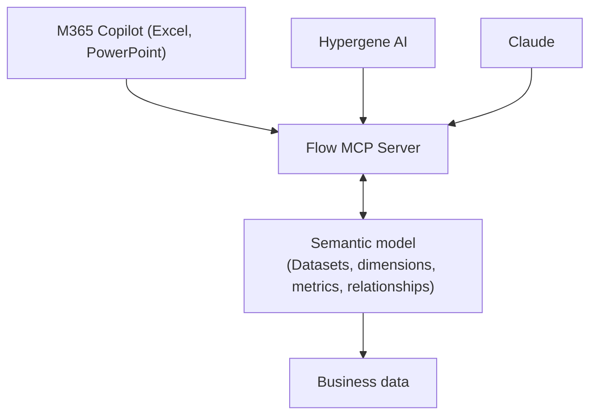

# Semantic models

Semantic models in Flow make your business data available to AI agents securely and reliably via the Model Context Protocol (MCP).

When you create a semantic model in Flow, you automatically get an MCP server with all the tools an AI agent needs to query your business data, analyze it, and build dashboards and reports. This works with native Hypergene AI agents, and with agents built in third-party apps such as `Claude Cowork` or `M365 Copilot`.

Typical use cases include:

- Building `PowerPoint` board reports with `M365 Copilot` or `Claude`.
- Creating operational reports and dashboards.
- AI-powered ad-hoc data analysis.
- Conversational Q&A over your business data, where users get answers in plain language without writing queries.

